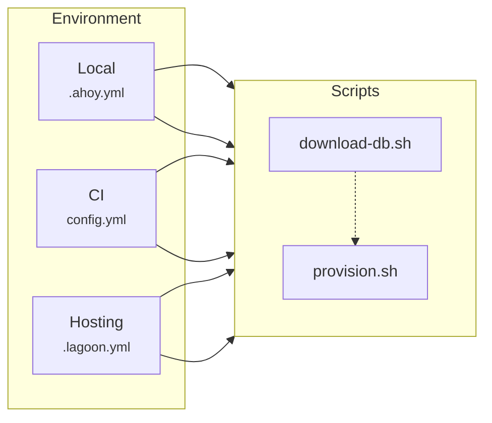
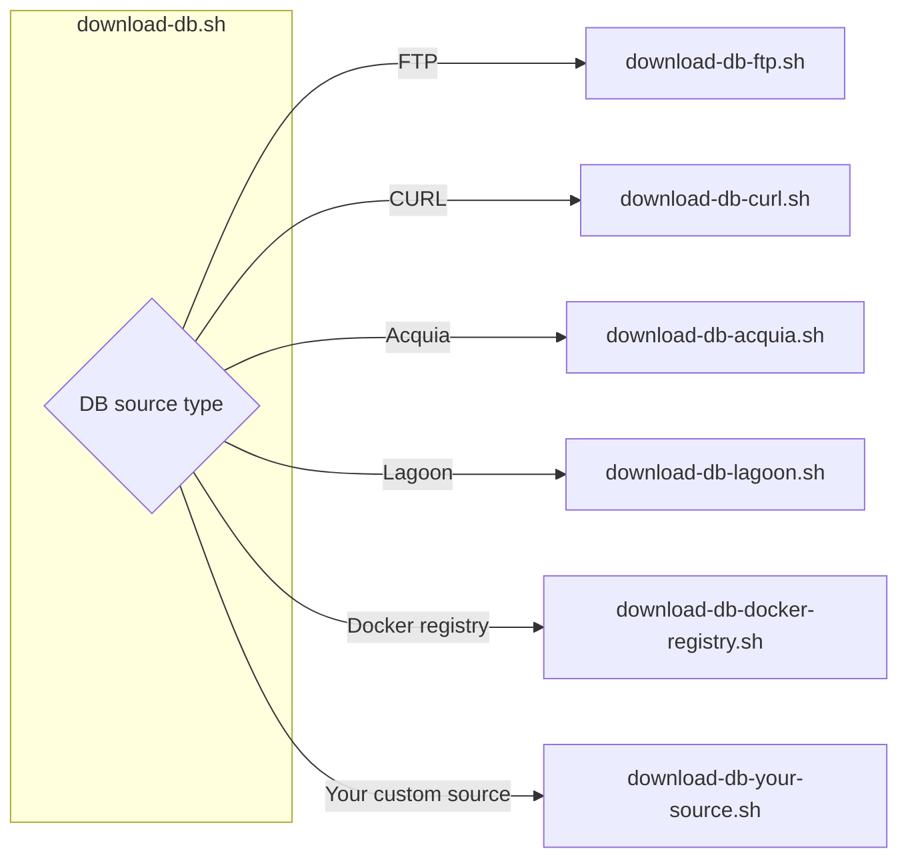

# Architecture

DrevOps offers a pre-configured project template that is reliable, tested and
ready-to-use. Its main goal is to streamline onboarding, making it as quick and
efficient as possible.

## Repository structure

The repository file structure follows the structure defined in
[drupal-composer/drupal-project](https://github.com/drupal-composer/drupal-project)
with addition of several configuration files and directories.

!!! note

    The directory structure is **exactly what you are going to get** after
    installation - there are no files being copied or moved from _magic_ places.

Click on the directory or file name below to navigate to the corresponding entry
in the codebase.

| Directory                                                                                | Type      | Purpose                                                                                                                                                                                      |
|------------------------------------------------------------------------------------------|-----------|----------------------------------------------------------------------------------------------------------------------------------------------------------------------------------------------|
| [`.circleci`](../../../../.circleci)                                                     | Directory | CircleCI configuration files.                                                                                                                                                                |
| `.data`                                                                                  | Directory | Downloaded database dump files. Excluded from the repository.                                                                                                                                |
| [`.github`](../../../../.github)                                                         | Directory | GitHub configuration files.                                                                                                                                                                  |
| [`.docker`](../../../../.docker)                                                         | Directory | Docker configuration files.                                                                                                                                                                  |
| [`docs`](../../../../docs)                                                               | Directory | Your project-specific documentation.                                                                                                                                                         |
| [`drush`](../../../../drush)                                                             | Directory | Drush configuration files.                                                                                                                                                                   |
| [`hooks`](../../../../hooks)                                                             | Directory | Acquia hooks. Removed if Acquia hosting is not in use.                                                                                                                                       |
| [`patches`](../../../../patches)                                                         | Directory | Patches for Drupal core and contrib modules.                                                                                                                                                 |
| [`scripts`](../../../../scripts)                                                         | Directory | Composer, DrevOps and custom project-specific scripts.                                                                                                                                       |
| [`tests`](../../../../tests)                                                             | Directory | Tests integration tests and test for scripts.                                                                                                                                                |
| [`web`](../../../../web)                                                                 | Directory | Drupal web root directory.                                                                                                                                                                   |
| [`.ahoy.yml`](../../../../.ahoy.yml)                                                     | File      | Ahoy configuration file.                                                                                                                                                                     |
| [`.ahoy.local.example.yml`](../../../../.ahoy.local.example.yml)                         | File      | An example of local Ahoy configuration file.                                                                                                                                                 |
| [`.dockerignore`](../../../../.dockerignore)                                             | File      | [Docker configuration file](https://docs.docker.com/engine/reference/builder/#dockerignore-file) to control the inclusion or exclusion of the files passed to Docker for the build.          |
| [`.editorconfig`](../../../../.editorconfig)                                             | File      | [EditorConfig](https://editorconfig.org/) helps maintain consistent coding styles for multiple developers working on the same project across various editors and IDEs.                       |
| [`.env`](../../../../.env)                                                               | File      | Environment variables list file. Main place to control project workflow using DrevOps variables. See [Variables](../workflows/variables.md) section for more details.                            |
| [`.env.local.default`](../../../../.env.local.default)                                   | File      | Example of the local environment file used to override environment variables to alter the workflow when developing locally. See [Variables](../workflows/variables.md) section for more details. |
| [`.gitignore`](../../../../.gitignore)                                                   | File      | Specifies intentionally untracked files to ignore.                                                                                                                                           |
| [`.gitignore.deployment`](../../../../.gitignore.deployment)                             | File      | Specifies intentionally untracked files to ignore when deploying an artifact. See [Deploy](../workflows/deployment.md) section for more details.                                                  |
| [`.lagoon.yml`](../../../../.lagoon.yml)                                                 | File      | Lagoon configuration file. Removed if Lagoon hosting is not in use.                                                                                                                          |
| [`behat.yml`](../../../../behat.yml)                                                     | File      | Behat [configuration](https://docs.behat.org/en/latest/user_guide/configuration.html) file.                                                                                                  |
| [`composer.json`](../../../../composer.json)                                             | File      | Composer [configuration](https://getcomposer.org/doc/04-schema.md) file.                                                                                                                     |
| [`docker-compose.yml`](../../../../docker-compose.yml)                                   | File      | Configuration file for [Docker Compose](https://docs.docker.com/compose/).                                                                                                                   |
| [`docker-compose.override.default.yml`](../../../../docker-compose.override.default.yml) | File      | Example override file for Docker Compose configuration.                                                                                                                                      |
| [`phpcs.xml`](../../../../phpcs.xml)                                                     | File      | PHP CodeSniffer [configuration](https://github.com/squizlabs/PHP_CodeSniffer/wiki/Advanced-Usage#using-a-default-configuration-file) file.                                                   |
| [`phpstan.neon`](../../../../phpstan.neon)                                               | File      | PHPStan [configuration](https://phpstan.org/config-reference) file.                                                                                                                          |
| [`phpunit.xml`](../../../../phpunit.xml)                                                 | File      | PHPUnit [configuration](https://docs.phpunit.de/en/9.6/configuration.html) file.                                                                                                                          |
| [`README.md`](../../../../README.md)                                                     | File      | Project main readme file.                                                                                                                                                                    |
| [`renovate.json`](../../../../renovate.json)                                             | File      | Renovate [configuration](https://docs.renovatebot.com/self-hosted-configuration/) file.                                                                                                      |

## Scripts

DrevOps provides a set of [POSIX](https://en.wikipedia.org/wiki/POSIX)-compliant
scripts designed to orchestrate workflows.

During installation, the scripts are added to a project repository into
`scripts/drevops` directory.

!!! note

    Using scripts instead of compiled binaries allows for **in-place per-project
    overrides** without needing to learn an additional programming language, compile
    sources, or rely on upstream dependencies.

    This means that you can modify any DrevOps script to suit your needs within
    your project repository instead of waiting for upstream to make changes to
    support a feature required in your project.

### Centralised workflows

The scripts aim to centralize workflows instead of adjusting them for every
environment (local, CI, dev, prod, etc.), reducing multiple points of failure.

This means that a developer updating a workflow for local environment, for
example, will not accidentally forget to update it for the CI environment, and
so on.

!!! tip

    The scripts are self-contained, making it possible to copy them
    individually to projects that do not utilize DrevOps.

Environment variables control the flow, with the same operations and order, but
certain operations can be enabled or disabled depending on the environment.

In practice, this means that, for example, a script used for downloading a
database is called from Ahoy for local development, from CI configuration, and
from the hosting configuration file is the same script `download-db.sh`.

!!! note

    The tooling (linters, test runners etc.) is configured to be used as-is,
    without any additional wrappers.

### Router scripts

The script from the example above is a _router_ script that invokes other,
more specific scripts (by sourcing them) based on the project configuration. This
design **keeps the entry point consistent** while allowing implementation updates
as needed without modifying the entry point everywhere.

For example, changing the database download source from `lagoon` to `s3` would
not require changes to any local, CI, or hosting scripts. Moreover, a developer
would not need to learn how to use `s3` to download a database or even know
how that download process is setup.

If a new database download method is introduced, the router
script `download-db.sh` can be easily extended to accommodate it,
without altering configuration files for services.

### Environment variables

The workflow within scripts is controlled via environment variables.

To alter the workflow for a specific environment, the variables would need to be
set within that environment via the configuration file or other means supported
by the environment (e.g. CircleCI and Acquia support injecting variables via UI).

See [Variables](../workflows/variables.md) section for more details.
