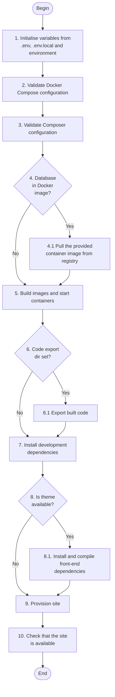

# Build

The entire process of building the site is automated using the [build](https://github.com/drevops/scaffold/blob/develop/scripts/drevops/build.sh)
script.

**It serves as a wrapper for commands that would normally be
executed manually and includes minimal workflow logic.**

This script is designed to be executed both locally and in a continuous
integration (CI) environment with a single command, and it handles the following
tasks:

- Validation of Docker Compose and Composer configurations
- Building container images and starting containers
- Installing the development dependencies
- Executing [the site provisioning script](https://github.com/drevops/scaffold/blob/develop/scripts/drevops/provision.sh)
- Verifying that the stack is functioning correctly and the site is
  accessible

To initiate the build process, simply run the command `ahoy build`.

::: tip

    Do not forget to download your database with `ahoy download-db` before
    running `ahoy build` or your site will not have a source database dump to
    import.

:::

## Build steps

### 1. Initialise variables from `.env`, `.env.local` and environment

Variables are read from multiple locations in [the predefined order](../workflows/variables.mdx#override-order-bottom-values-win).

### 2. Validate Docker Compose configuration

The script validates the Docker Compose configuration and exits if it is not
valid. This is designed to catch errors in the configuration early.

### 3. Validate Composer configuration

The script validates the Composer configuration and exits if it is not valid.
The `composer.lock` will be validated as well.

### 4. Database in container image?

If the database is stored in the container image rather than a dump file, the
script will pull the image from the registry and will use it as a database. 

### 5. Build images and start containers

The script will build the container images and start the containers.
Only required files will be copied into the image and only production
dependencies will be installed. See more in [the Docker section](../tools/docker.mdx).

### 6. Code export directory set?

If the `$DREVOPS_CODE_EXPORT_DIR` variable is set, the script will export the
built code into the specified directory, which than can be used to build a
deployment artifact. This is used in CI to support hosting environments
that support only artifact code deployments (no build pipeline), like Acquia.

### 7. Install development dependencies

The script will install the development dependencies, which are required for
the site development and testing. These are installed separately from the
step 5 dependencies to avoid adding the production image and code artifact
with unnecessary dependencies (which also widens the security perimeter and
increases the build time).

### 8. Is theme available?

If the environment variable `$DRUPAL_THEME` is set, the script will
install the front-end dependencies and compile assets. Note that this already
happens during the Docker build process, so this step runs **only locally**
to update the assets to use development versions based on the current theme
build configuration (e.g. during development, the theme assets may not need
to be minimised etc.).

### 9. Provision site

This step will provision the site using [the site provisioning script](https://github.com/drevops/scaffold/blob/develop/scripts/drevops/provision.sh),
which contains all the workflow logic that controls which actions are taken
when the site is provision. It runs in all environments.

### 10. Check that the site is available

This step uses [doctor script](https://github.com/drevops/scaffold/blob/develop/scripts/drevops/doctor.sh) to
check that the stack is running correctly and that the site is available
(bootstrappable) and will exit with an error. 
See more in [the Doctor section](/tools/doctor).
