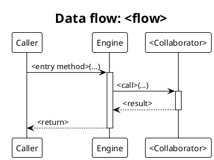

# Render customizer diagrams

`docs/architecture/` holds the customizer engine's architecture diagrams as PlantUML sources (`.puml`) plus rendered `.svg`:

- `architecture.puml` - layered component architecture
- `dataflow-collect.puml` - the headless collection lifecycle (a sequence diagram)
- `dataflow-tui.puml` - the interactive panel-TUI loop (a sequence diagram)
- `README.md` - a narrative walkthrough that explains how the customizer is set up and how it runs, embedding the rendered SVGs as supporting visuals (not a bare index)

All content is derived from the source under `src/` (the packages are the `src/` subdirectories; the lifecycle is what `Engine::collect()` and `PanelController::run()` do), never from design docs. If the docs and the code disagree, the code wins.

## Prerequisite

PlantUML must be on the PATH:

```bash
plantuml -version
```

If it is missing, install it with `brew install plantuml` (it needs Java, which is already present on macOS).

## Task A - regenerate every SVG

After editing any `.puml`, re-render all SVGs from the package root, then confirm each `.svg` changed and stop:

```bash
plantuml -tsvg docs/architecture/*.puml
```

## Task B - add a new data-flow diagram

1. **Trace the flow from source.** Pick the entry method (e.g. `Engine::collect()`, `Engine::run()`, `PanelController::run()`) and follow it through the classes it calls: `InputResolver`, `Discovery`, `Deriver` + `Transform`, `ConditionEvaluator`, `HandlerRegistry` -> a `HandlerInterface`, then `Answers` / `Theme` / `WidgetFactory` on the way out.
2. **Create** `docs/architecture/dataflow-<flow>.puml` from the template below.
3. **Fill** the participants and messages from the real call path: solid arrows (`->`) for the forward path, dashed (`-->`) for returns. Mirror `dataflow-collect.puml`.
4. **Render** it: `plantuml -tsvg docs/architecture/dataflow-<flow>.puml`.
5. **Index** it: add a section and `` to `docs/architecture/README.md`.

### Template



## Task C - keep the walkthrough current

`docs/architecture/README.md` is a walkthrough, not an index: it walks the reader through describing a config, attaching handlers, the headless collection lifecycle and the interactive TUI, embedding `architecture.svg`, `dataflow-collect.svg` and `dataflow-tui.svg` at the points they support. After any structural change (a new package, a changed lifecycle step, a new diagram), update the prose so it still matches `src/`, and embed any new SVG where it supports the narrative. Always regenerate the SVGs (Task A) in the same pass so the visuals and the prose agree.

## Conventions

- Keep the sequence-diagram header (`!theme plain`, the Helvetica skinparams, `title Data flow: ...`) identical across diagrams so they read as a set.
- Package colours in `architecture.puml` are keyed by role: config blue (`#E3F2FD`), engine orange (`#FFF3E0`), resolution green (`#E8F5E9`), handlers purple (`#F3E5F5`), output/input slate (`#ECEFF1`), interactive red (`#FFEBEE`). Reuse them if a new diagram needs layer colours.
- **Escape a leading pair of `-` in labels.** PlantUML's Creole renders a pair of `--` as strikethrough; write such labels with `~--` if you must show a CLI flag.
