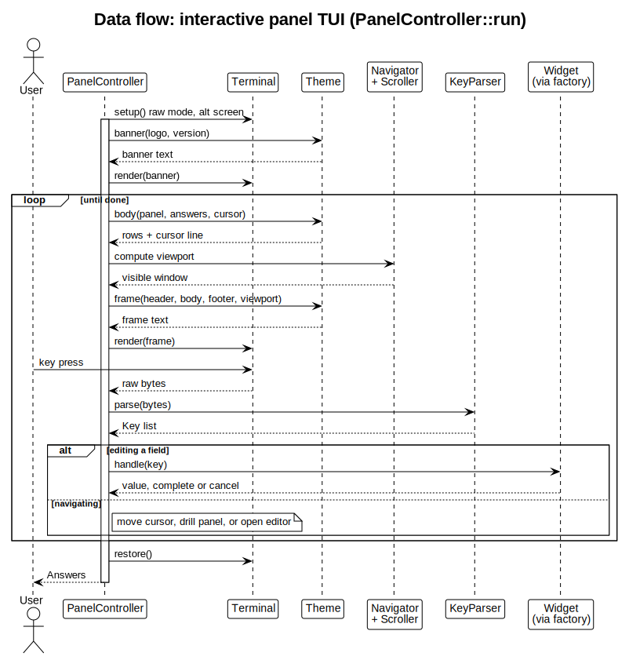

# Architecture

Diagrams of the `drevops/customizer` engine, rendered from PlantUML sources with the [`render-customizer-diagrams`](../../.claude/skills/render-customizer-diagrams/SKILL.md) skill. Everything here is derived from `src/`; if the docs and the code disagree, the code wins. Regenerate the SVGs with:

    plantuml -tsvg docs/architecture/*.puml

## Component architecture

The packages mirror the `src/` subdirectories; arrows show the main dependencies.

## Headless collection

The lifecycle of `Engine::collect()`: resolve inputs, discover, apply dynamic and static defaults, derive to a fixpoint, gate conditional fields, then validate and transform the active answers.

## Interactive panel TUI

The loop of `PanelController::run()`: render a themed frame, read and parse a key, then navigate or edit a field, until the user finishes.

