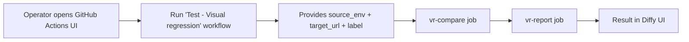
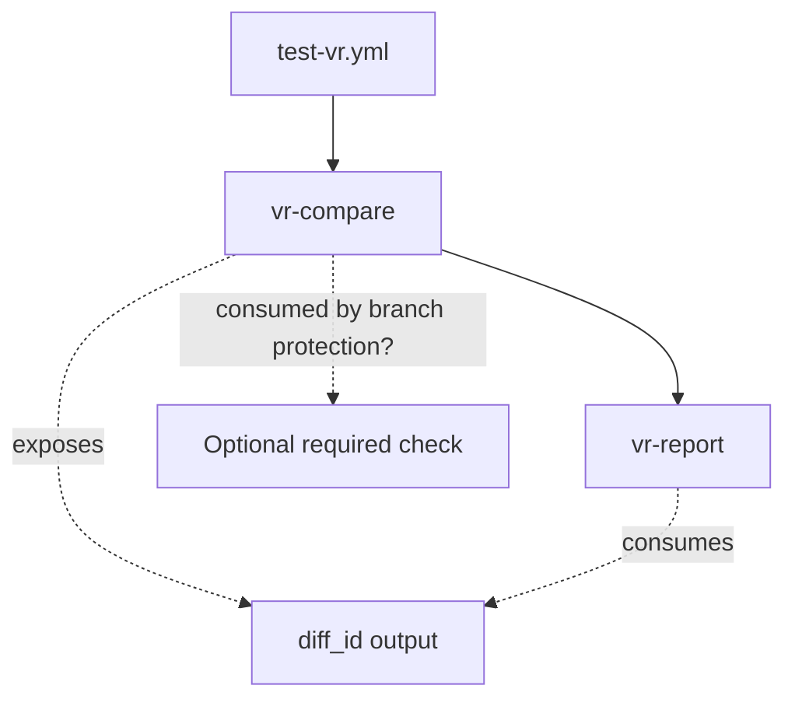

# Visual regression

**Vortex** ships an optional visual regression workflow powered by
[Diffy](../tools/diffy.mdx). It compares the just-deployed environment against
a baseline (typically `production`) and posts the result back to the related
pull request.

## When does it run?

Three entry points are supported. None of them are blocking by default - they
become blocking only when the consumer wires the `vr-compare` check into
GitHub branch protection rules.

### 1. Automatic on deployments

```mermaid
flowchart LR
  A[PR opened with `VR` label] --> B[build-test-deploy.yml]
  B --> C[Hosting provider deploys async]
  C --> D[Host post-deploy hook]
  D --> E[notify router]
  E --> F[notify-diffy channel]
  F --> G[GitHub repository_dispatch event_type=vr_run]
  G --> H[test-vr.yml workflow]
  H --> I[vr-compare parses PR from target URL, checks label]
  I --> J[vr-report]
  J --> K[PR comment + Diffy report link]
```



`notify-diffy` dispatches the workflow with a payload containing only the
commit SHA, branch, target URL, label, and source environment - **no PR
number**. The workflow itself extracts the PR number from the deployed
environment URL by matching the `pr-<number>` segment (e.g.
`https://app.pr-123.example.lagoon.cloud/` resolves to PR #123) and
verifies the `VR` label is present (case-insensitive). If the target URL
has no `pr-<number>` segment, the deployment is not a PR environment and
the run is skipped.

This means the PR lookup works uniformly across hosting providers - the host
only needs to expose the deployed environment URL, which all of them do.

### 2. Manual on any URL



Use this entry point for ad-hoc comparisons against a known environment URL.
No PR is involved, so the result is visible only in the Diffy UI (and in the
workflow run log).

### 3. Limiting which branches dispatch

By default, every deployment that triggers the notify router dispatches the
workflow - the workflow then decides whether to actually run by looking up
the associated open PR and checking its labels.

To skip the dispatch entirely for certain branches (and save GitHub Actions
minutes spent on the lookup), set `VORTEX_NOTIFY_DIFFY_BRANCHES` to a
comma-separated branch allowlist. With this set, only deployments on listed
branches dispatch; everything else is silently skipped at the host hook.

Leave this variable empty (default) to let the workflow's PR-label gate be
the sole gate.

## Automated dependency PRs

PRs raised by Renovate (or any other automated dependency-update bot) typically
do not carry the `VR` label - they carry their own bot label (e.g.
`Dependencies`). To still run visual regression on them, the workflow consults
`VR_DIFFY_AUTO_BRANCHES`: a comma-separated glob list of PR head
branches that bypass the `VR` label gate.

The default value is `deps/*`, matching Vortex's Renovate `branchPrefix`
configuration. Other common values:

| Bot | Branch prefix | Suggested value |
|---|---|---|
| Renovate (Vortex default) | `deps/` | `deps/*` |
| Renovate (default config) | `renovate/` | `renovate/*` |
| Dependabot | `dependabot/` | `dependabot/*` |

Multiple patterns can be combined with commas:
`VR_DIFFY_AUTO_BRANCHES=deps/*,dependabot/*`. Set the variable to
empty to disable the bypass entirely (every PR, including bot PRs, then needs
the label).

### Default behavior out of the box

With `VR_DIFFY_AUTO_BRANCHES=deps/*` (default) and
`VR_DIFFY_PR_LABEL=VR` (default):

| PR head branch | Has `VR` label? | Runs? |
|---|---|---|
| `feature/foo` | yes | yes (label gate) |
| `feature/foo` | no | no |
| `deps/drupal-core-11.2` | no | **yes** (matches `deps/*`) |
| `deps/drupal-core-11.2` | yes | yes (matches `deps/*`, label irrelevant) |

Consumers using Dependabot just append:
`VR_DIFFY_AUTO_BRANCHES=deps/*,dependabot/*`. Consumers who want the
label as the only gate (no auto-bypass) set the variable to empty.

## How the PR is resolved

The workflow extracts the PR number from the deployed environment URL by
matching the `pr-<number>` segment. For example:

```text
https://app.pr-123.example.lagoon.cloud/   ->  PR #123
https://nginx.pr-42.project.amazee.io/     ->  PR #42
```

This means:

- The host must deploy PR environments to a URL that contains the
  `pr-<number>` segment - the standard convention on Lagoon, Acquia, and
  most cloud hosting providers.
- No GitHub API call is needed to resolve the PR.
- The host does not need to provide a PR number directly; the URL is the
  source of truth.

If the target URL has no `pr-<number>` segment (for example, a deploy to a
named environment like `dev`/`test`/`prod`), the workflow treats it as
"not a PR deployment" and exits without running.

## Missed-window behavior

If the `VR` label is added to a PR **after** the deployment completes, no
comparison is run. This is deliberate: a late-applied label should not silently
launch a Diffy job against a stale environment.

To re-trigger after applying the label, either push an empty commit (forces a
new deployment → new dispatch) or use the manual workflow entry point.

## Job structure



`vr-compare`:

1. Checks the PR label (when running for a PR).
2. Installs the pinned Diffy CLI.
3. Calls `diffy project:compare` with the target URL, commit SHA, and a label.
4. Polls the comparison status, printing progress to the job log every
   `VR_DIFFY_POLL_INTERVAL` seconds.
5. Exposes the diff ID as a job output.

`vr-report`:

1. Fetches the diff result as JSON.
2. Extracts the overall change percentage, the per-page page count, and the
   shared report URL.
3. Posts (or skips, when no PR is in scope) a summary comment on the PR.

## Making it blocking

Vortex does not block merges on visual regression results by default.

To make `vr-compare` a required check:

1. Open *Settings > Branches* on the consumer repository.
2. Edit the branch protection rule for the target branch (typically `main`).
3. Under *Require status checks to pass before merging*, add **vr-compare**
   to the required checks.

`vr-report` is never required - its failure means the comment could not be
posted, which is not a merge-blocker.

## Configuration

For the full list of secrets and variables, see
[Diffy - Repository configuration](../tools/diffy.mdx#repository-configuration).
