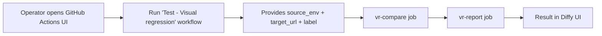
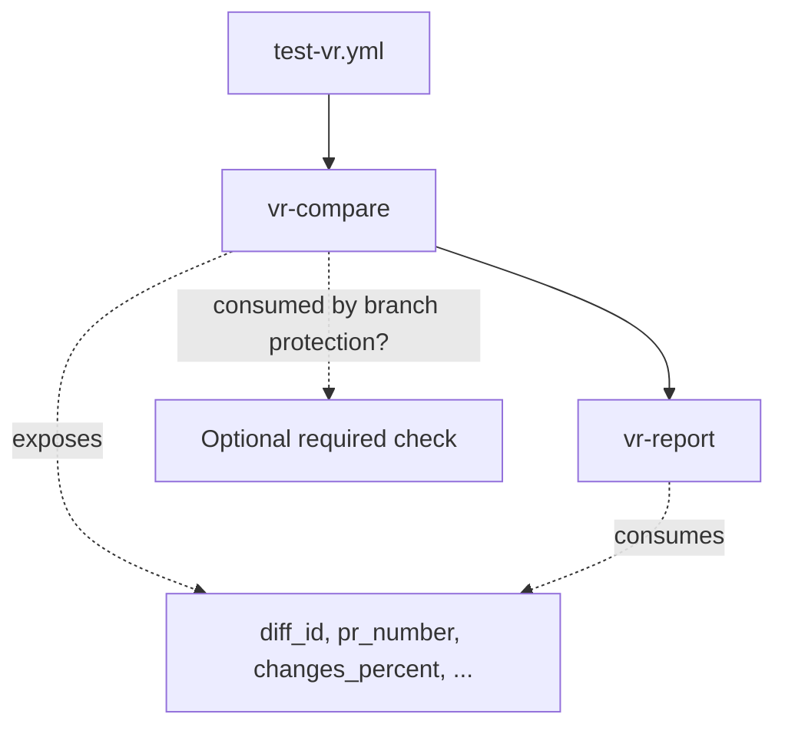

# Visual regression

**Vortex** ships an optional visual regression workflow powered by
[Diffy](../tools/diffy.mdx). It compares the just-deployed environment
against a baseline (typically `production`) and posts the result back to
the related pull request.

## Account setup

Before enabling the workflow, set up a Diffy project for the site:

1. Create an account at [app.diffy.website](https://app.diffy.website).
2. Create a project for the site.
3. Configure the `production` (and optionally `staging`, `development`)
   environment URLs inside the Diffy project settings.
4. Generate an API key from
   [app.diffy.website/#/keys](https://app.diffy.website/#/keys).

The numeric **project ID** is visible in the Diffy project URL and is
referenced by the workflow as `VR_DIFFY_PROJECT_ID`.

## Repository configuration

The shipped `test-vr.yml` workflow reads configuration from GitHub Actions
secrets and repository variables.

### Secrets

| Name | Required | Purpose |
|---|---|---|
| `VR_DIFFY_API_KEY` | yes | Diffy API key |

Add this under *Settings > Secrets and variables > Actions > Repository
secrets*.

### Variables

| Name | Default | Purpose |
|---|---|---|
| `VR_DIFFY_PROJECT_ID` | (none, required) | Numeric Diffy project ID (visible in the Diffy project URL) |
| `VR_DIFFY_CLI_VERSION` | `0.1.53` | Pinned `diffy-cli` release used by `vr-compare` |
| `VR_DIFFY_MAX_WAIT` | `2700` | Maximum seconds to wait for a comparison to complete (45 minutes) |
| `VR_DIFFY_POLL_INTERVAL` | `30` | Polling interval in seconds |
| `VR_DIFFY_PR_LABEL` | `VR` | PR label that opts a deployment into visual regression. Case-insensitive |
| `VR_DIFFY_AUTO_BRANCHES` | `deps/*` | Comma-separated glob list of PR head branches that bypass the label gate (matches Renovate's `branchPrefix`). Set to empty to require the label on every PR. |
| `VR_DIFFY_SOURCE_ENV` | `production` | Default Diffy source environment for comparisons |

Add these under *Settings > Secrets and variables > Actions > Repository
variables*.

### Deployment-side configuration

For automatic dispatch, the deployment environment (Lagoon post-rollout,
Acquia post-code-deploy hook, or similar) needs a GitHub token with `repo`
scope exposed as `VORTEX_NOTIFY_DIFFY_TOKEN` (falls back to
`VORTEX_NOTIFY_GITHUB_TOKEN` if set, then to `GITHUB_TOKEN`). The
repository name is taken from `VORTEX_NOTIFY_DIFFY_REPOSITORY` (falls back
to `VORTEX_NOTIFY_GITHUB_REPOSITORY`).

Add `diffy` to `VORTEX_NOTIFY_CHANNELS` to enable the dispatch:

```ini
VORTEX_NOTIFY_CHANNELS=email,github,diffy
```

## How to trigger a comparison

Two entry points are supported. Neither is blocking by default - both
become blocking only when the consumer wires the `vr-compare` check into
GitHub branch protection rules.

### 1. Automatic on deployments

```mermaid
flowchart LR
  A[PR opened with `VR` label] --> B[build-test-deploy.yml]
  B --> C[Hosting provider deploys async]
  C --> D[Host post-deploy hook]
  D --> E[notify router]
  E --> F[notify-diffy channel]
  F --> G[GitHub repository_dispatch event_type=vr_run]
  G --> H[test-vr.yml workflow]
  H --> I[vr-compare parses PR from target URL, checks label]
  I --> J[vr-report]
  J --> K[PR comment + Diffy report link]
```



`notify-diffy` dispatches the workflow with a payload containing the
branch, target URL, label, and source environment - **no PR number, no
commit SHA**. The workflow itself extracts the PR number from the
deployed environment URL by matching the `pr-<number>` segment (e.g.
`https://app.pr-123.example.lagoon.cloud/` resolves to PR #123) and
verifies the `VR` label is present (case-insensitive). If the target URL
has no `pr-<number>` segment, the deployment is not a PR environment and
the run is skipped.

This means the PR lookup works uniformly across hosting providers - the
host only needs to expose the deployed environment URL, which all of
them do.

### 2. Manual on any URL



Use this entry point for ad-hoc comparisons against a known environment
URL. No PR is involved, so the result is visible only in the Diffy UI
(and in the workflow run log).

## Limiting which branches dispatch

By default, every deployment that triggers the notify router dispatches
the workflow - the workflow then decides whether to actually run by
parsing the target URL and checking the PR label.

To skip the dispatch entirely for certain branches (and save GitHub
Actions minutes), set `VORTEX_NOTIFY_DIFFY_BRANCHES` to a
comma-separated branch allowlist. With this set, only deployments on
listed branches dispatch; everything else is silently skipped at the
host hook.

Leave this variable empty (default) to let the workflow's PR-label gate
be the sole gate.

## Automated dependency PRs

PRs raised by Renovate (or any other automated dependency-update bot)
typically do not carry the `VR` label - they carry their own bot label
(e.g. `Dependencies`). To still run visual regression on them, the
workflow consults `VR_DIFFY_AUTO_BRANCHES`: a comma-separated glob list
of PR head branches that bypass the `VR` label gate.

The default value is `deps/*`, matching Vortex's Renovate `branchPrefix`
configuration. Other common values:

| Bot | Branch prefix | Suggested value |
|---|---|---|
| Renovate (Vortex default) | `deps/` | `deps/*` |
| Renovate (default config) | `renovate/` | `renovate/*` |
| Dependabot | `dependabot/` | `dependabot/*` |

Multiple patterns can be combined with commas:
`VR_DIFFY_AUTO_BRANCHES=deps/*,dependabot/*`. Set the variable to empty
to disable the bypass entirely (every PR, including bot PRs, then needs
the label).

### Default behavior out of the box

With `VR_DIFFY_AUTO_BRANCHES=deps/*` (default) and
`VR_DIFFY_PR_LABEL=VR` (default):

| PR head branch | Has `VR` label? | Runs? |
|---|---|---|
| `feature/foo` | yes | yes (label gate) |
| `feature/foo` | no | no |
| `deps/drupal-core-11.2` | no | **yes** (matches `deps/*`) |
| `deps/drupal-core-11.2` | yes | yes (matches `deps/*`, label irrelevant) |

Consumers using Dependabot just append:
`VR_DIFFY_AUTO_BRANCHES=deps/*,dependabot/*`. Consumers who want the
label as the only gate (no auto-bypass) set the variable to empty.

## How the PR is resolved

The workflow extracts the PR number from the deployed environment URL by
matching the `pr-<number>` segment. For example:

```text
https://app.pr-123.example.lagoon.cloud/   ->  PR #123
https://nginx.pr-42.project.amazee.io/     ->  PR #42
```

This means:

- The host must deploy PR environments to a URL that contains the
  `pr-<number>` segment - the standard convention on Lagoon, Acquia, and
  most cloud hosting providers.
- No GitHub API call is needed to resolve the PR.
- The host does not need to provide a PR number directly; the URL is the
  source of truth.

If the target URL has no `pr-<number>` segment (for example, a deploy to
a named environment like `dev`/`test`/`prod`), the workflow treats it as
"not a PR deployment" and exits without running.

## Missed-window behavior

If the `VR` label is added to a PR **after** the deployment completes,
no comparison is run. This is deliberate: a late-applied label should
not silently launch a Diffy job against a stale environment.

To re-trigger after applying the label, either push an empty commit
(forces a new deployment → new dispatch) or use the manual workflow
entry point.

## Job structure



`vr-compare`:

1. Resolves the PR number from the target URL and gates on the label
   (or auto-branch pattern for dependency PRs).
2. Installs the pinned Diffy CLI.
3. Calls `diffy project:compare` with the target URL and a label.
4. Polls the comparison status, printing progress to the job log every
   `VR_DIFFY_POLL_INTERVAL` seconds.
5. Fetches the diff result and exposes the diff ID, PR number, change
   percentage, page counts, and shared report URL as job outputs.

`vr-report`:

1. Posts a sticky comment on the PR with the summary and a link to the
   Diffy report. Re-deploys edit the same comment rather than stacking.

## Making it blocking

Vortex does not block merges on visual regression results by default.

To make `vr-compare` a required check:

1. Open *Settings > Branches* on the consumer repository.
2. Edit the branch protection rule for the target branch (typically
   `main`).
3. Under *Require status checks to pass before merging*, add
   **vr-compare** to the required checks.

`vr-report` is never required - its failure means the comment could not
be posted, which is not a merge-blocker.

## Costs and quotas

Diffy bills per screenshot set. Vortex's default gating (`VR` label on
PRs only, plus the `deps/*` auto-branch list) keeps the run rate low.
Adjust `VR_DIFFY_PR_LABEL`, `VR_DIFFY_AUTO_BRANCHES`, and
`VORTEX_NOTIFY_DIFFY_BRANCHES` to suit the team's review rhythm.

## Disabling

Remove `diffy` from `VORTEX_NOTIFY_CHANNELS` and delete the
`.github/workflows/test-vr.yml` workflow file.

To remove the integration entirely, re-run the installer and answer
"no" to the visual regression prompt.
