# Provision

## Overview

The provisioning process (handled by the `provision.sh` script) sets up a
Drupal site by either restoring an existing database or installing a fresh
instance using a profile, followed by running the necessary configuration
import and database updates.

The main purpose of the script is to automate the setup of a Drupal site
in every environment, ensuring consistency and eliminating manual steps.

## Provisioning flow

```mermaid
graph TD;
    START((🚀  Start)) --> B;

    B{💡 Skip provision? <sup>1</sup>}
    B -- No --> C;
    B -- Yes --> B1(((🏁 End)));

    C{💡 Can bootstrap?};
    C -- Yes --> C1;
        C1{💡 Override DB? <sup>2</sup>}
        C1 --> | No<br>Preserve existing DB | D;
        C1 -- Yes --> C11;
            C11[🗑️ Drop DB];
            C11 --> C12
                C12{💡 Use DB dump <br>or profile? <sup>3</sup>}
                C12 -- DB dump --> C121[🛢️ Import from DB dump];
                    C121 --> D
                C12 -- Profile --> C122[📦 Install from profile];
                    C122 --> D
    C -- No --> C11

    D@{ shape: braces, label: "Site is bootstrappable" }
    D --> E

    E{💡 Skip other operations? <sup>4</sup>}
        E -- No --> F;
        E -- Yes --> E1(((🏁 End)));

    F[🚧  Enable maintenance mode <sup>5</sup>];
    F --> G

    subgraph SG3 ["Standard operations"]
        direction BT
        G[⬇️ Import configuration];
        G --> H[🔄 Run DB updates];
        H --> I[🧹 Rebuild caches];
        I --> J[🔄 Run deployment updates]
    end

    J --> K["😷 Run DB sanitization <sup>6</sup>"]
    K --> L["⚙️ Run custom scripts"];
    L --> M["🚧  Disable maintenance mode <sup>5</sup>"];

    M-->END
    END(((🏁 End)));
```



### Customizing flow

Control the provisioning flow with the following environment variables:

| Variable                                  | Description                                                                               |
|-------------------------------------------|-------------------------------------------------------------------------------------------|
| `VORTEX_PROVISION_SKIP=1`                 | Kill-switch to skip provisioning entirely.                                                |
| `VORTEX_PROVISION_USE_PROFILE=1`          | Install from a Drupal profile instead of importing from a database dump.                  |
| `VORTEX_PROVISION_OVERRIDE_DB=1`          | Drop an existing database before importing from dump/installing from profile.             |
| `VORTEX_PROVISION_POST_OPERATIONS_SKIP=1` | Skip configuration imports, database updates, and other post-provisioning steps.          |
| `VORTEX_PROVISION_USE_MAINTENANCE_MODE=1` | Enable maintenance mode right after the site is bootstrappable and disable it at the end. |
| `VORTEX_PROVISION_SANITIZE_DB_SKIP=1`     | Disable database sanitization.                                                            |

## Maintenance mode

During the provisioning process, you may want to enable maintenance mode to
prevent users from accessing the site while it is being updated.

To enable maintenance mode, set the `VORTEX_PROVISION_USE_MAINTENANCE_MODE=1`
environment variable in your `.env` file to apply it globally or set it in your
hosting provider's specific environment.

## Database sanitization

The `provision.sh` script includes a step to sanitize the database after
provisioning. This step is essential for ensuring that sensitive data is not
present in non-production environments.

:::warning

    This step does not prevent developers from accessing sensitive data in
    the database dump directly. If your database has highly sensitive data,
    consider sanitizing the database dump before it can be downloaded.

:::

To disable database sanitization, set the `VORTEX_PROVISION_SANITIZE_DB_SKIP=1`
in the `.env` file or in your hosting provider's specific environment.

### Customizing database sanitization

Use the following environment variables to customize the database sanitization:

| Variable                                                   | Default value                        | Description                                        |
|------------------------------------------------------------|--------------------------------------|----------------------------------------------------|
| `VORTEX_PROVISION_SANITIZE_DB_EMAIL`                       | `user_%uid@your-site-domain.example` | Database sanitized account email replacement.      |
| `VORTEX_PROVISION_SANITIZE_DB_PASSWORD`                    | Random                               | Database sanitized account password replacement.   |
| `VORTEX_PROVISION_SANITIZE_DB_REPLACE_USERNAME_WITH_EMAIL` | `0` (disabled)                       | Replace username with mail.                        |
| `VORTEX_PROVISION_SANITIZE_DB_ADDITIONAL_FILE`             | `./scripts/sanitize.sql`             | Path to file with custom sanitization SQL queries. |

## Running custom scripts

The `provision.sh` script can execute custom scripts or commands after the
standard provisioning steps. This feature allows you to automate additional
tasks specific to your project (migrations, conditionally enabling modules etc).

To run custom scripts, create a new file in the `scripts/custom` directory
with the `provision-` prefix and the `.sh` extension. The script will be
automatically sourced and executed after the standard provisioning steps.
Make sure the script is executable:
`chmod +x scripts/custom/provision-10-example.sh`.

It is recommended to use a 2-digit suffix to control the order of execution:
e.g., `provision-10-example.sh`, `provision-20-another-example.sh`.

Expand below to see an example script [
`scripts/custom/provision-10-example.sh`](https://github.com/drevops/vortex/blob/develop/scripts/custom/provision-10-example.sh)
script:

import CodeBlock from '@theme/CodeBlock';
import ProvisionScriptExample from '!!raw-loader!./../../../../scripts/custom/provision-10-example.sh';

<details>
  <summary>Example of a custom script</summary>

<CodeBlock language="bash">{ProvisionScriptExample}</CodeBlock>

</details>

### Conditional execution

You may choose to only perform an action based on a specific environment (the
value of `$settings['environment']` is populated by
the [Drupal settings file](settings#1-environment-type-constants-definitions)):

```bash
if drush php:eval "print \Drupal\core\Site\Settings::get('environment');" | grep -q -e dev -e ci -e local; then
  echo "==> Executing example operations in DEV, CI or Local environment."
fi
```

You may also conditionally perform an action based on whether the database is
freshly imported or not:

```bash
if [ "${VORTEX_PROVISION_OVERRIDE_DB:-0}" = "1" ]; then
  echo "  > Fresh database detected."
else
  echo "  > Existing database detected."
fi
```
