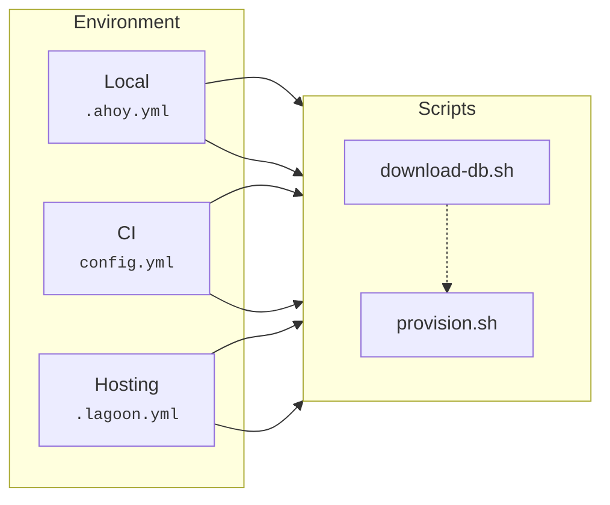
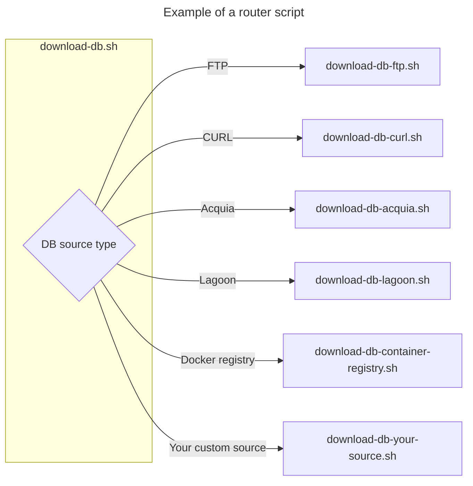

---
hide:
  - toc
---
# Architecture

**Vortex** offers a pre-configured project template that is reliable, tested and
ready-to-use. Its main goal is to streamline onboarding, making it as quick and
efficient as possible.

## Zen of **Vortex**

Similar to [Zen of Python](https://www.python.org/dev/peps/pep-0020/), **Vortex**
is built on its own set of principles:

* Simple is better than complex.
* Favor upstream and standard practices over custom implementations.
* Errors should never pass silently.
* Readability counts.
* Explicit logging helps.

## Repository structure

The repository file structure follows the structure defined in
[drupal-composer/drupal-project](https://github.com/drupal-composer/drupal-project)
with addition of several configuration files and directories.

:::note

    The directory structure is **exactly what you are going to get** after
    installation - there are no files being copied or moved from _magic_ places.

:::

```
├── .circleci                # CircleCI configuration files.
├── .data                    # Database dump files directory. Excluded.
├── .docker                  # Docker configuration files.
│   ├── config               #   Additional configuration for every Docker service.
│   └── scripts              #   Scripts to run in the Docker services during image build
├── .github                  # GitHub configuration files.
├── .logs                    # Test logs and screenshots. Excluded.
├── config                   # Drupal configuration.
│   ├── ci                   #   Config split configuration for CI environment.
│   ├── default              #   Default configuration.
│   ├── dev                  #   Config split configuration for DEV environment.
│   ├── local                #   Config split configuration for local environment.
│   └── test                 #   Config split configuration for test environment.
├── docs                     # Your project documentation.
├── drush                    # Drush configuration files.
├── hooks                    # Acquia hooks. Removed if not using Acquia hosting.
│   ├── common               #   Hook implementations that run on all environments.
│   ├── library              #   Library of hook implementations.
│   └── prod                 #   Hook implementations that run in prod environment.
├── patches                  # Patches for packages.
├── scripts                  # Composer, Vortex and custom project scripts.
│   ├── composer             #   Composer scripts.
│   ├── custom               #   Custom project scripts.
│   └── vortex               #   Vortex workflow scripts.
├── tests                    # Integration and configuration tests.
│   ├── behat                #   Behat BDD tests.
│   └── phpunit              #   Configuration unit tests
├── web                      # Drupal web root directory.
│   ├── modules/custom/ys_core    #  Custom module scaffold.
│   │   ├── tests/src        #         Tests scaffold.
│   │   │   ├── Functional   #           Functional test scaffold and example.
│   │   │   ├── Kernel       #           Kernel test scaffold and example.
│   │   │   ├── Traits       #           Helper traits to use in tests.
│   │   │   └── Unit         #           Unit test scaffold and example.
│   │   └── ys_core.deploy   #         Drush deploy example.
│   └── modules/custom/ys_search  #  Custom search module scaffold.
├── .ahoy.yml                # Ahoy configuration file.
├── .ahoy.local.example.yml  # Ahoy local configuration file.
├── .dockerignore            # Docker ignore configuration file.
├── .editorconfig            # Helps maintain consistent coding styles.
├── .env                     # Environment variables to control project workflow using variables.
├── .env.local.default       # Environment variables local overrides.
├── .gitignore               # Intentionally untracked files to ignore in Git.
├── .gitignore.artifact    # Intentionally untracked files to ignore in artifact deployment.
├── .lagoon.yml              # Lagoon configuration file. Removed if not using Lagoon hosting.
├── .twig-cs-fixer.php       # Twig CS Fixer configuration file.
├── behat.yml                # Behat configuration file.
├── composer.json            # Composer configuration file.
├── docker-compose.yml       # Docker Compose configuration file.
├── phpcs.xml                # PHP CodeSniffer configuration file.
├── phpmd.xml                # PHP Mess Detector configuration file.
├── phpstan.neon             # PHPStan configuration file.
├── phpunit.xml              # PHPUnit configuration file.
├── README.md                # Project main readme file.
└── renovate.json            # Renovate configuration file.
```

## Scripts

**Vortex** provides a set of [POSIX](https://en.wikipedia.org/wiki/POSIX)-compliant
shell scripts designed to orchestrate workflows.

During installation, the scripts are added to your project repository into
`scripts/vortex` directory.

Using shell scripts instead of compiled binaries allows you to modify files to
fit your needs without requiring to learn an additional programming language,
compile sources, or waiting for someone upstream to update the code.

:::note

    We are [looking into providing](https://github.com/drevops/scaffold/issues/1198) `pre-` and `post-` hooks for scripts so
    that you can extend the functionality without modifying the original source
    code.

:::

### Centralised workflows

> A workflow is a sequence of steps or tasks to accomplish a specific goal.

**Vortex** comes with as set of pre-defined workflow scripts used to
standardise the development process.

For example, the `scripts/vortex/download-db.sh` script is used to download a
database from any supported hosting provider or a custom location.

Another example is a `scripts/vortex/provision.sh` script that is used to
provision a website in a consistent way, allowing to alter the flow using
[environment variables](../workflows/variables.mdx) and enhance it via custom
scripts.

The scripts aim to centralize workflows instead of adjusting them for every
environment (local, CI, dev, prod, etc.), reducing multiple points of failure.
This means that a developer updating a workflow for local environment, for
example, will not accidentally forget to update it for the CI environment, and
so on.

In the diagram below, the `download-db.sh` and `provision.sh` scripts are
**consistently** called from the configuration files within an environment.



See [Workflows](../../workflows) section for more details.

### Router scripts

The script from the example above is a _router_ script that invokes other,
more specific scripts (by sourcing them) based on the project configuration.
This design **keeps the entry point consistent** while allowing implementation
updates as needed without modifying the entry point in multiple places.

:::note

    The router script always starts with a verb to indicate the action it performs.
    Specific scripts always start with a name of the router script.

:::

In the diagram below, for example, the `download-db.sh` script, being a router
script, invokes another script specific to the database download source
(controlled with an environment variable).

In this example, changing the database download source from `lagoon` to `s3`
would not require changes to any local, CI, or hosting scripts.

In addition, a developer would not need to learn how to use `s3` to
download a database or even know how that download process was setup.

If a new database download method is introduced, the router
script `download-db.sh` can be easily extended to accommodate it,
without altering configuration files for services.



### Environment variables

The workflow within scripts is controlled via environment variables.

To alter the workflow for a specific environment, the variables would need to be
set within that environment via the `.env` configuration file or other means
supported by the environment (e.g. CircleCI and Acquia support injecting
variables via UI).

See [Variables](../workflows/variables.mdx) section for more details.
