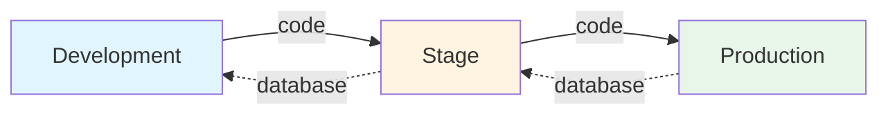

# Releasing

Software releases are a critical part of the development lifecycle. A well-structured release process ensures code quality, minimizes deployment risks, and maintains clear communication across teams.

A typical release process consists of several key components:

1. **Release Manager** - A person or team responsible for coordinating and executing releases
2. **Release Flow** - The sequence of environments and steps code goes through from development to production
3. **Versioning Workflow** - The branching strategy that governs how code moves through environments (GitFlow being the most common)
4. **Version Scheme** - The numbering system used to identify releases (CalVer, SemVer, or custom)
5. **Release Documentation** - Runsheets, checklists, and procedures stored in accessible locations
6. **Automated Deployment** - CI/CD pipelines that handle the technical deployment process

**Vortex** provides comprehensive support for all these components, with sensible defaults and integration points for popular hosting platforms.

## Release flow

Projects typically follow a three-tier environment strategy with clear directional flows:

- **Development** - Latest development code, not yet released. May be unstable, but CI tests should pass.
- **Stage** - Pre-production environment. Mirrors production as closely as possible. Used for final release testing.
- **Production** - Live customer-facing application. Stable and reliable. Source of truth for data.

:::info Environment Agreement
The specific environment setup (dev/stage/production) should be agreed upon within your team and documented in your project. Some teams may use additional environments (e.g., UAT, pre-prod) or different naming conventions.
:::

Code goes "up" (from lower to higher environments) while database goes "down" (from higher to lower environments).

This means that the production database is the primary source of truth - it's what code is applied to. When performing a release, you are applying a new version of code to a database within a specific environment.

To ensure that code changes work correctly with real data structures, the following process is followed in lower environments:

1. Database is copied from a higher environment to a lower one (e.g., production → stage → development)
2. Code is deployed to that environment to be tested against the copied database
3. Testing is performed to ensure everything works correctly

:::tip
CI pipelines also use a copy of the production database (refreshed daily) to run all tests, ensuring code changes work with real data structures.
:::

You would use a Versioning Workflow (like GitFlow) to manage how code moves
across releases using the Version Scheme (like CalVer or SemVer).

You would document your release procedures in Release Documentation (like
`docs/releasing.md`) and create a release runsheet to guide release managers
through the release process.

Finally, the actual deployment to production is handled via Automated Deployment
where, based on your hosting provider, the deployment process is fully automated.

## Production deployment process

Once code is finalized and pushed, the deployment process to production is technically identical to deploying to other environments and is **fully automated**.

For Acquia and Lagoon hosting, **Vortex** integrates directly with their deployment systems to ensure smooth releases.

For other hosting providers, you can integrate the provision steps into your hosting deployment configuration if it supports post-deployment hooks or custom scripts.

➡️ See [Drupal > Provision](/docs/drupal/provision#provisioning-flow) to learn more about what provisioning steps are performed during deployments.

## Documentation

### `docs/releasing.md`

Your project includes a `docs/releasing.md` file that serves as the canonical release documentation for your team. This file contains:

- **Version scheme summary** - Which versioning system your project uses (CalVer, SemVer, or Other)
- **GitFlow instructions** - Step-by-step guide for your specific git-flow setup
- **Release procedures** - Custom procedures specific to your project

You can extend this file with:

- **Detailed release procedures** - A comprehensive outline of _what_ actions to take during releases:
  - Steps to create and finish releases
  - Steps to deploy to production
  - Steps to rollback
  - Steps to verify releases
- **Release run template** - A detailed checklist of _who_ does _what_ and _when_ during releases. This would be cloned into a separate runsheet for each release.

## Monitoring

### New Relic integration

**Vortex** provides integration with New Relic for release tracking and monitoring.

**Deployment Markers**: When configured, **Vortex** automatically creates deployment markers in New Relic when releases are deployed to your environments. These markers help correlate performance changes, errors, and other metrics with specific releases.

**Benefits**:

- Visualize before/after release performance
- Correlate errors with specific deployments
- Track deployment frequency
- Monitor release impact in real-time

➡️ See [Deployment > Notifications](/docs/deployment/notifications)

## Best practices

1. **Always use release branches** - Never release directly from `develop` or feature branches
2. **Backup before release** - Ensure you have recent backups of code and data
3. **Document your process** - Keep `docs/releasing.md` updated with team conventions
4. **Automate everything possible** - Leverage **Vortex**'s automation capabilities
5. **Test in Stage first** - Always validate releases in a production-like environment
6. **Communicate releases** - Notify stakeholders before, during, and after releases
7. **Monitor post-release** - Watch metrics and logs for issues after deployment
8. **Have a rollback plan** - Document and test your rollback procedures
9. **Use consistent versioning** - Stick to your chosen version scheme

## See also

| Topic | Description |
|-------|-------------|
| [GitFlow](gitflow) | Branch structure and release operations |
| [Versioning](versioning) | CalVer, SemVer, and custom version schemes |
