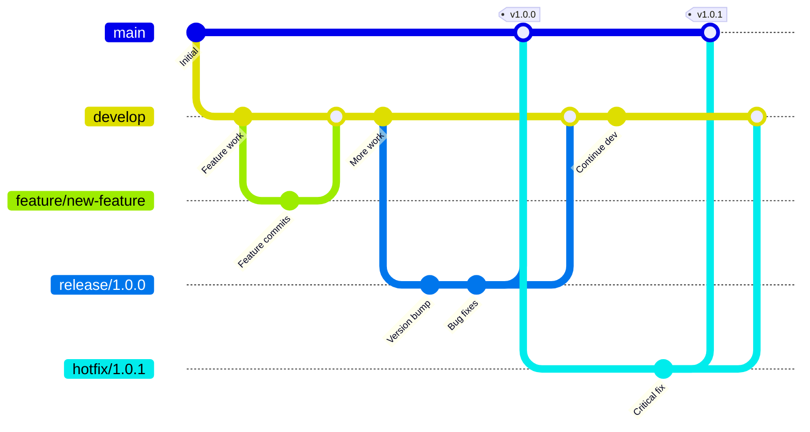

# GitFlow versioning workflow

[git-flow](https://nvie.com/posts/a-successful-git-branching-model/) is a
versioning workflow that allows you to maintain clean separation between development
and production code.

It allows you to have a stable development branch (`develop`) and a production-ready
branch (`main`), while providing dedicated branches for feature development,
release preparation, and hotfixes.



## Branch structure

- **`develop`** - Development branch where features are integrated
- **`main`** - Production-ready code, always stable and tagged with releases
- **`feature/*`** - Individual feature development branches
- **`release/*`** - Release preparation branches (e.g., `release/25.1.0`)
- **`hotfix/*`** - Emergency fixes for production (e.g., `hotfix/25.1.1`)

<details>
  <summary>`production` branch</summary>

  Most hosting providers support deploying specific git tags directly. In this
  case, no separate `production` branch is needed - you simply tag releases on
  `main` and deploy those tags.

  Some hosting providers (like **Lagoon**) require a git branch to deploy from,
  so tag-based deployments are not supported. In this case, you must create a
  `production` branch and sync code from `main` to `production` after each
  release.

  While it's possible to automate copying `main` to `production` on tag creation
  via CI/CD, this automation was conceptually avoided to prevent accidental
  deployments to production without human oversight.

</details>

## Release operations

Below are the typical steps to perform a release using git-flow. See [cheat sheet](https://danielkummer.github.io/git-flow-cheatsheet/) for a quick reference on git-flow commands.

1. **Start Release**

   ```shell
   git flow release start X.Y.Z
   ```

   Creates a `release/X.Y.Z` branch from `develop`. It is recommended to push
   the branch to remote.

2. **Release Preparation**
   - Final bug fixes
   - Documentation updates
   - Release notes preparation

3. **Finish Release**

   ```shell
   git flow release finish X.Y.Z
   ```

   - Merges release branch to `main`
   - Tags the release
   - Merges back to `develop`
   - Deletes the release branch

4. **Deploy to Production**
   - **Tag-based hosting:** Deploy the tag directly
   - **Branch-based hosting (e.g., Lagoon):** Manually sync to `production` branch

     ```shell
     git push origin main:production
     ```

## Expected release outcome

A successful release should meet these criteria:

1. Release branch exists as `release/X.Y.Z` in GitHub repository
2. Release tag exists as `X.Y.Z` in GitHub repository
3. The `HEAD` of the `main` branch has `X.Y.Z` tag
4. The hash of the `HEAD` of the `main` branch exists in the `develop` branch
   - This ensures everything pushed to `main` exists in `develop`
   - Important if `main` had any hotfixes not yet merged to `develop`
5. There are no open PRs in GitHub related to the release
