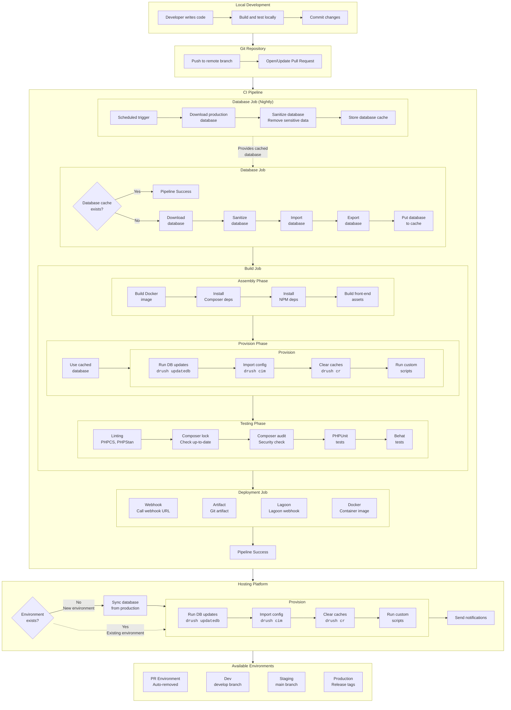

```mermaid
%%==============================================================================
%% Vortex Code Lifecycle Diagram
%% Naming Convention:
%% - All identifiers use UPPER_SNAKE_CASE with hierarchical prefixes
%%   - Subgraphs: SUBGRAPH_PARENT_CHILD (e.g., SUBGRAPH_CI_BUILD_JOB_ASSEMBLY_PHASE)
%%   - Regular nodes: PARENT_CHILD_NODE, no SUBGRAPH_ prefix (e.g., CI_BUILD_JOB_ASSEMBLY_PHASE_BUILD_DOCKER)
%%==============================================================================

%%{init: {'flowchart': {'curve': 'linear'}}}%%
flowchart TB
    subgraph SUBGRAPH_LOCAL["Local Development"]
        direction LR
        LOCAL_DEV["Developer writes code"]
          --> LOCAL_BUILD_LOCAL["Build and test locally"]
          --> LOCAL_COMMIT["Commit changes"]
    end

    subgraph SUBGRAPH_GIT["Git Repository"]
        direction LR
        GIT_PUSH["Push to remote branch"]
          --> GIT_PR["Open/Update Pull Request"]
    end

    %% CI Pipeline (Outer Box)
    subgraph SUBGRAPH_CI["CI Pipeline"]
        direction TB

        subgraph SUBGRAPH_CI_DATABASE_JOB_NIGHTLY["Database Job (Nightly)"]
            direction LR
            CI_DATABASE_JOB_NIGHTLY_SCHEDULE["Scheduled trigger"]
              --> CI_DATABASE_JOB_NIGHTLY_DB_PROD_DOWNLOAD["Download production<br/>database"]
              --> CI_DATABASE_JOB_NIGHTLY_DB_SANITIZE_NIGHTLY["Sanitize database<br/>Remove sensitive data"]
              --> CI_DATABASE_JOB_NIGHTLY_DB_CACHE_NIGHTLY["Store database cache"]
        end

        subgraph SUBGRAPH_CI_DATABASE_JOB["Database Job"]
            direction LR

            CI_DATABASE_JOB_DB_CACHE_CHECK{"Database cache<br/>exists?"}
            CI_DATABASE_JOB_DB_CACHE_SUCCESS["Pipeline Success"]

            CI_DATABASE_JOB_DB_DOWNLOAD_NEW["Download<br/>database"]
            CI_DATABASE_JOB_DB_SANITIZE["Sanitize<br/>database"]
            CI_DATABASE_JOB_DB_IMPORT["Import<br/>database"]
            CI_DATABASE_JOB_DB_EXPORT["Export<br/>database"]
            CI_DATABASE_JOB_DB_PUT_CACHE["Put database<br/>to cache"]
        end

        subgraph SUBGRAPH_CI_BUILD_JOB["Build Job"]
            direction TB

            subgraph SUBGRAPH_CI_BUILD_JOB_ASSEMBLY_PHASE["Assembly Phase"]
                direction LR
                CI_BUILD_JOB_ASSEMBLY_PHASE_BUILD_DOCKER["Build Docker<br/>image"]
                  --> CI_BUILD_JOB_ASSEMBLY_PHASE_COMPOSER["Install<br/>Composer deps"]
                  --> CI_BUILD_JOB_ASSEMBLY_PHASE_NPM["Install<br/>NPM deps"]
                  --> CI_BUILD_JOB_ASSEMBLY_PHASE_BUILD_ASSETS["Build front-end<br/>assets"]
            end

            subgraph SUBGRAPH_CI_BUILD_JOB_PROVISION_PHASE["Provision Phase"]
                direction LR
                CI_BUILD_JOB_PROVISION_PHASE_DB_DOWNLOAD["Use cached<br/>database"]

                subgraph SUBGRAPH_CI_BUILD_JOB_PROVISION_PHASE_PROVISION_OPS["Provision"]
                    direction LR
                    CI_BUILD_JOB_PROVISION_PHASE_PROVISION_OPS_PROV_DB_UPDATES_CI["Run DB updates<br/><code>drush updatedb</code>"]
                      --> CI_BUILD_JOB_PROVISION_PHASE_PROVISION_OPS_PROV_CONFIG_IMPORT_CI["Import config<br/><code>drush cim</code>"]
                      --> CI_BUILD_JOB_PROVISION_PHASE_PROVISION_OPS_PROV_CACHE_CLEAR_CI["Clear caches<br/><code>drush cr</code>"]
                      --> CI_BUILD_JOB_PROVISION_PHASE_PROVISION_OPS_PROV_CUSTOM_CI["Run custom<br/>scripts"]
                end

                CI_BUILD_JOB_PROVISION_PHASE_DB_DOWNLOAD --> SUBGRAPH_CI_BUILD_JOB_PROVISION_PHASE_PROVISION_OPS
            end

            subgraph SUBGRAPH_CI_BUILD_JOB_TEST_PHASE["Testing Phase"]
                direction LR
                CI_BUILD_JOB_TEST_PHASE_LINT["Linting<br/>PHPCS, PHPStan"]
                  --> CI_BUILD_JOB_TEST_PHASE_LOCK_CHECK["Composer lock<br/>Check up-to-date"]
                  --> CI_BUILD_JOB_TEST_PHASE_AUDIT["Composer audit<br/>Security check"]
                  --> CI_BUILD_JOB_TEST_PHASE_UNIT["PHPUnit<br/>tests"]
                  --> CI_BUILD_JOB_TEST_PHASE_BEHAT["Behat<br/>tests"]
            end
        end

        subgraph SUBGRAPH_CI_DEPLOYMENT_JOB["Deployment Job"]
            direction LR
            CI_DEPLOYMENT_JOB_WEBHOOK["Webhook<br/>Call webhook URL"]
              ~~~ CI_DEPLOYMENT_JOB_ARTIFACT["Artifact<br/>Git artifact"]
              ~~~ CI_DEPLOYMENT_JOB_LAGOON["Lagoon<br/>Lagoon webhook"]
              ~~~ CI_DEPLOYMENT_JOB_DOCKER["Docker<br/>Container image"]
        end

        CI_SUCCESS["Pipeline Success"]
    end

    subgraph SUBGRAPH_HOSTING["Hosting Platform"]
        direction LR

        HOSTING_ENV_DECISION{"Environment<br/>exists?"}
        HOSTING_NEW_DB_SYNC["Sync database<br/>from production"]

        subgraph SUBGRAPH_HOSTING_PROVISION_OPS["Provision"]
            direction LR
            HOSTING_PROVISION_OPS_PROV_DB_UPDATES["Run DB updates<br/><code>drush updatedb</code>"]
              --> HOSTING_PROVISION_OPS_PROV_CONFIG_IMPORT["Import config<br/><code>drush cim</code>"]
              --> HOSTING_PROVISION_OPS_PROV_CACHE_CLEAR["Clear caches<br/><code>drush cr</code>"]
              --> HOSTING_PROVISION_OPS_PROV_CUSTOM["Run custom<br/>scripts"]
        end

        HOSTING_SEND_NOTIFICATIONS["Send notifications"]
    end

    subgraph SUBGRAPH_ENVIRONMENTS["Available Environments"]
        direction LR
        ENVIRONMENTS_PR_ENV["PR Environment<br/>Auto-removed"]
          ~~~ ENVIRONMENTS_DEV_ENV["Dev<br/>develop branch"]
          ~~~ ENVIRONMENTS_STAGE_ENV["Staging<br/>main branch"]
          ~~~ ENVIRONMENTS_PROD_ENV["Production<br/>Release tags"]
    end

    %% Main Flow - Only OUTER Box to OUTER Box Connections
    SUBGRAPH_LOCAL --> SUBGRAPH_GIT
    SUBGRAPH_GIT --> SUBGRAPH_CI
    SUBGRAPH_CI --> SUBGRAPH_HOSTING
    SUBGRAPH_HOSTING --> SUBGRAPH_ENVIRONMENTS

    %% Internal flows within CI Pipeline
    SUBGRAPH_CI_DATABASE_JOB_NIGHTLY -.->|Provides cached<br/>database| SUBGRAPH_CI_DATABASE_JOB

    %% Database Job internal flow
    CI_DATABASE_JOB_DB_CACHE_CHECK -->|Yes| CI_DATABASE_JOB_DB_CACHE_SUCCESS
    CI_DATABASE_JOB_DB_CACHE_CHECK -->|No| CI_DATABASE_JOB_DB_DOWNLOAD_NEW
    CI_DATABASE_JOB_DB_DOWNLOAD_NEW --> CI_DATABASE_JOB_DB_SANITIZE
    CI_DATABASE_JOB_DB_SANITIZE --> CI_DATABASE_JOB_DB_IMPORT
    CI_DATABASE_JOB_DB_IMPORT --> CI_DATABASE_JOB_DB_EXPORT
    CI_DATABASE_JOB_DB_EXPORT --> CI_DATABASE_JOB_DB_PUT_CACHE

    SUBGRAPH_CI_DATABASE_JOB --> SUBGRAPH_CI_BUILD_JOB
    SUBGRAPH_CI_BUILD_JOB_ASSEMBLY_PHASE --> SUBGRAPH_CI_BUILD_JOB_PROVISION_PHASE
    SUBGRAPH_CI_BUILD_JOB_PROVISION_PHASE --> SUBGRAPH_CI_BUILD_JOB_TEST_PHASE
    SUBGRAPH_CI_BUILD_JOB --> SUBGRAPH_CI_DEPLOYMENT_JOB
    SUBGRAPH_CI_DEPLOYMENT_JOB --> CI_SUCCESS

    %% Internal flows within Hosting Platform
    HOSTING_ENV_DECISION -->|No<br/>New environment| HOSTING_NEW_DB_SYNC
    HOSTING_NEW_DB_SYNC --> SUBGRAPH_HOSTING_PROVISION_OPS
    HOSTING_ENV_DECISION -.->|Yes<br/>Existing environment| SUBGRAPH_HOSTING_PROVISION_OPS
    SUBGRAPH_HOSTING_PROVISION_OPS --> HOSTING_SEND_NOTIFICATIONS
```

