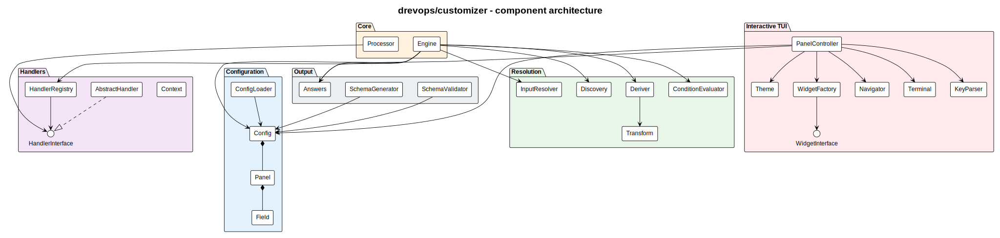
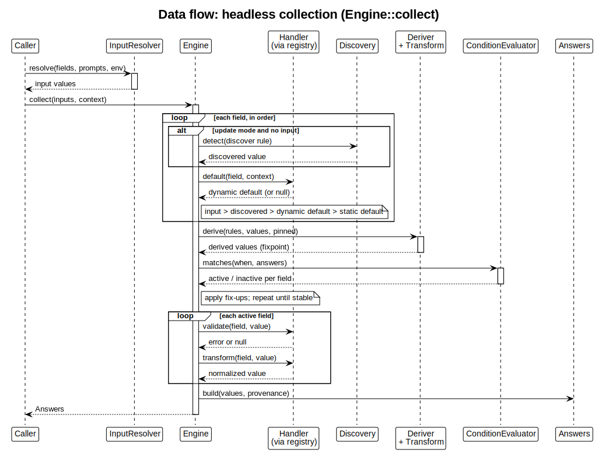
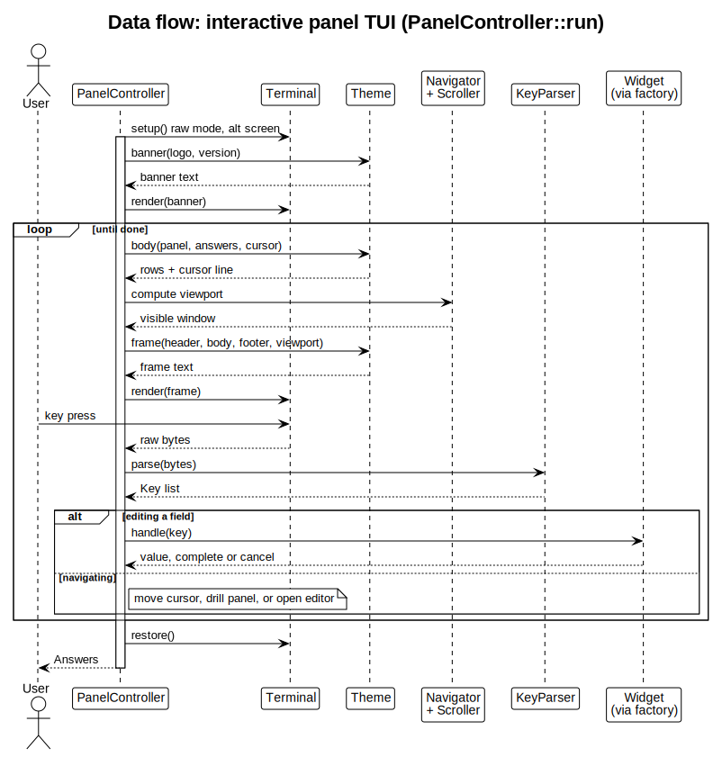

# How the customizer works

This is a walkthrough of the `drevops/tui` engine - what you assemble to build a customizer, and what happens when it runs. The diagrams are rendered from the PlantUML sources in this directory by the [`render-customizer-diagrams`](../../.claude/skills/render-customizer-diagrams/SKILL.md) skill; everything below is derived from `src/`, so if the prose and the code disagree, the code wins.

## The shape of it

At the centre is the **Engine**. Everything else is either something you hand it (a configuration, a set of handlers, a theme) or something it produces (validated answers, a JSON schema). The packages below mirror the `src/` subdirectories, and the arrows are the main dependencies.

Read it in three bands:

- **Left - what you provide.** A **Config** (assembled by the fluent `Form` builder into `Config` -> `Panel` -> `Field`) and, optionally, **Handlers** (classes that carry behaviour). Together these declare the questions and how each one behaves.
- **Middle - the Engine and its helpers.** The Engine drives collection, leaning on `InputResolver` (read a payload), `Discovery` (detect from the directory), `Deriver` + `Transform` (compute values), and `ConditionEvaluator` (decide what is shown).
- **Right - what comes out, and how it is shown.** `Answers` (plus a `SchemaGenerator` / `SchemaValidator` for agents and forms), and the **interactive TUI** - `PanelController` composing a `Theme`, widgets, a `Navigator` and a `Terminal`.

## Step 1 - describe the questions

You declare the questions in PHP with the fluent `Form` builder: panels holding fields. A field has an `id`, a `type` (text, select, multiselect, suggest, confirm) and optional rules - `default`, `required`, `options`, `when` (show it only when a condition holds), `derive` (compute it from other fields) and `discover` (detect it from the target directory). The builder validates the declaration - rejecting duplicate field ids - and builds the immutable `Config` model. Nothing runs yet; this is pure description.

## Step 2 - attach behaviour where you need it

Most fields need no code. When one does - a dynamic default, validation, a normalisation, or a side effect that writes files - you add a handler class named after the field id (`machine_name` -> `MachineName`) in a namespace you register. The engine discovers it automatically. A handler exposes four hooks: `default()`, `validate()`, `transform()` and `process()`.

## Step 3 - collect the answers

`Engine::collect()` turns the config plus whatever the caller supplied into a settled set of answers. This is the heart of the engine:

Walking the sequence:

1. **Resolve each field's starting value**, in priority order: an explicit input (from `--prompts` or the environment, via `InputResolver`) beats a discovered value (in update mode), which beats a handler's dynamic `default()`, which beats the static default in the config.
2. **Settle the derived and conditional fields.** `Deriver` recomputes `derive` values (with `Transform`) until they stop changing, `ConditionEvaluator` decides which fields are active from their `when` rules, and fix-ups reconcile dependents - repeated until the whole set is stable.
3. **Validate and transform** every active field through its handler.
4. **Emit `Answers`** - the values plus their provenance (default, discovered, edited).

The same lifecycle runs whether the caller is a human at the TUI or a script passing JSON, which is why the engine is testable without a terminal.

## Step 4 - let a person answer (optional)

For interactive use, `PanelController::run()` seeds itself with the engine's resolved answers and drives a panel TUI until the user is done:

Each turn it asks the **Theme** to compose a frame (the theme owns colours, glyphs and layout), computes the visible window with the `Navigator` and `Scroller`, and renders it to the `Terminal`. A key press is parsed by `KeyParser`; the controller either moves the cursor / drills into a sub-panel, or opens a widget to edit a field. Editing writes the new value back and marks it "edited". When the user finishes, it returns the same `Answers` object the headless path produces.

## Step 5 - apply the answers (optional)

Collecting produces answers; a consumer that scaffolds a project acts on them. `Processor::apply()` runs each field's handler `process()` in a config-driven order - fields sort by `weight` (ties in reverse declaration order), interleaved with any field-less `processors` declared on the config (for example an ".env" carry first, a cleanup last). Only active fields process, and the order lives entirely in the config, never in code.

## Regenerating this document

The diagrams are PlantUML (`.puml`) rendered to `.svg`. After editing a source, re-render and keep this walkthrough in step with any structural change:

    plantuml -tsvg docs/architecture/*.puml

The [`render-customizer-diagrams`](../../.claude/skills/render-customizer-diagrams/SKILL.md) skill covers rendering, adding a new data-flow diagram, and keeping this walkthrough current.
