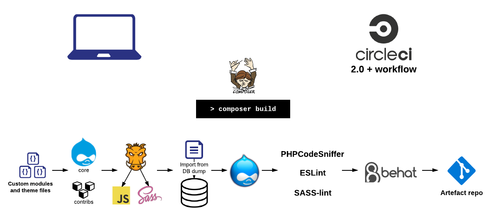
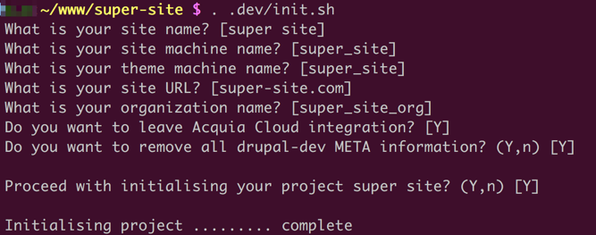

# drupal-dev
Composer-based Drupal 7 project scaffolding with code linting, tests and automated builds (CI) integration.

**Looking for Drupal 8 version?**
[Click here to switch to Drupal 8 version](https://github.com/integratedexperts/drupal-dev/tree/8.x)

## Usage
1. Create a blank project repository.
2. Download an archive of this project and extract into repository directory.
3. **Run `. .dev/init.sh` and follow the prompts.** DO NOT SKIP THIS STEP!
4. Commit all files to your repository and push.
5. To enable CI integration, login to [Circle CI](https://circleci.com/) with your GitHub account, go to "Projects" -> "Add project", select your new project from the list and click on "Setup project" and click "Start building" button.
6. To start developing locally:
   - Make sure that you have `make`, [composer](https://getcomposer.org/), [Docker](https://www.docker.com/) and [Pygmy](https://docs.amazee.io/local_docker_development/pygmy.html) installed.
   - `make download-db`    
   - `pygmy up`
   - `make build`

## What is included
- Drupal 7 composer-based configuration
  - contrib modules management
  - libraries management
  - support for patches
- Custom core module scaffolding
- Custom theme scaffolding: Gruntfile, SASS/SCSS, globbing and Livereload.    
- `make` scripts to build and rebuild the project (consistent commands used in all environments).
- PHP, JS and SASS code linting with pre-configured Drupal standards
- Behat testing configuration + usage examples 
- Integration with [Circle CI](https://circleci.com/) (2.0):
  - project full build (fully built Drupal site with production DB)
  - code linting
  - testing (including Selenium-based Behat tests)
  - **artefact deployment to [destination repository](https://github.com/integratedexperts/drupal-dev-destination)**
- Integration with [dependencies.io](https://dependencies.io) to keep the project up-to-date.
- Integration with Acquia Cloud.
- Project documentation [template](.dev/README.template.md)
- Project initialisation script

## Build workflow
Automated build is orchestrated to run stages in separate containers, allowing to run tests in parallel and fail fast.

## FAQs

## Why `Makefile`?
- Consistent commands across projects - unified Developer Experience (DX).
- Standalone file that can be easily copied across projects.
- Works on all *nix systems.
- Does not require additional language or package installation.
- Workflow is no longer captured in places that were not designed for it: Composer scripts, NPM scripts etc.

## Why not Lando, DDEV, Docksal?
- Running the same workflow commands in Local and CI is a paramount.
- Current solution is pure Docker/Docker Compose and does not require and additional configuration generators.
- No dependency on additional tool.

## Why use `amazeeio` containers?
- [Amazee.io](https://www.amazee.io/) maintain their containers as they are powering their open-source hosting platform [Lagoon](https://github.com/amazeeio/lagoon).
- Changes to containers are fully tested with every change using CI systems (part of Lagoon).
- Containers are production-ready.

## Why CircleCI?
- Very fast.
- Supports workflow.
- Supports parallelism.
- Provides remote Docker engine to run and build containers with layer caching.
- Allows customising build runner container.
- Flexible [pricing model](https://circleci.com/pricing/) (for proprietary projects). Free for open-source.

## Why dependencies.io?
- Configurable runners for different types of dependencies (PHP, JS, Ruby etc).
- Configurable base branch, new branch prefixes and assigned labels.
- Supports pre- and post-update hooks. 
- Flexible [pricing model](https://www.dependencies.io/pricing/) for proprietary projects.

## Presentation

https://goo.gl/CRBFw2

## Useful projects

- [Robo Artifact Builder](https://github.com/integratedexperts/robo-git-artefact) - Robo task to push git artefact to remote repository
- [Behat Screenshot](https://github.com/integratedexperts/behat-screenshot) - Behat extension and a step definition to create HTML and image screenshots on demand or test fail.
- [Behat Progress Fail](https://github.com/integratedexperts/behat-format-progress-fail) - Behat output formatter to show progress as TAP and fails inline.
- [Behat Relativity](https://github.com/integratedexperts/behat-relativity) - Behat context for relative elements testing
