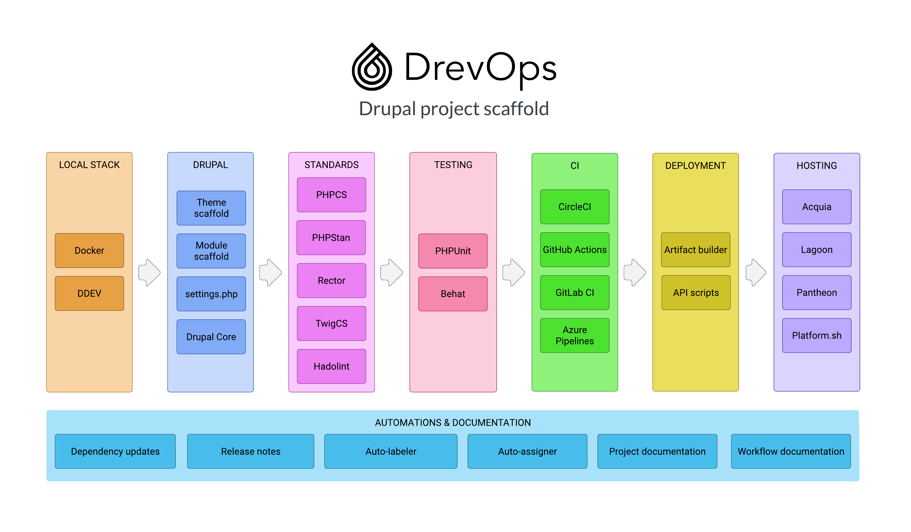

<div align="center">
  <picture>
    <source media="(prefers-color-scheme: dark)" srcset=".scaffold/docs/content/assets/logo-horiz-dark.png">
    
  </picture>
</div>

<h3 align="center">Drupal project scaffold</h3>

<div align="center">

[](https://github.com/drevops/scaffold/actions/workflows/scaffold-test-common.yml)
[](https://github.com/drevops/scaffold/actions/workflows/scaffold-test-docs.yml)
[](https://circleci.com/gh/drevops/scaffold)
[](https://codecov.io/gh/drevops/scaffold)


</div>

## Purpose

Make it easy to set up, develop and maintain Drupal websites

## Approach

Use **tested** Drupal project scaffold with DevOps integrations for CI and hosting platforms

Similar to [Zen of Python](https://www.python.org/dev/peps/pep-0020/), we use our own set of principles:

* Simple is better than complex.
* Rely on upstream sources as much as possible.
* Favor standard practices over custom implementations.
* Errors should never pass silently.
* Explicit logging helps.
* Readability counts.
* If the implementation is hard to explain, it's a bad idea.

[Read more about architecture](https://docs.drevops.com/latest/introduction/architecture/)

## Installation

Our [installer](https://github.com/drevops/installer) simplifies setup, letting you choose only the features you need. It will integrate the latest scaffold release into your codebase and you will choose which changes to commit.

```bash
curl -SsL https://install.drevops.com > install.php
php install.php
rm -r install.php
```

Alternatively, clone this repository and adjust the configuration by manually editing or deleting the sections that aren't necessary for your setup.

## Features

<div align="center">
  <picture>
    <source media="(prefers-color-scheme: dark)" srcset=".scaffold/docs/content/assets/diagram-dark.png">
    
  </picture>
</div>

The following list includes ✅ completed and 🚧 upcoming features.

* 💧 Drupal
  * ✅ Based on [drupal-composer/drupal-project](https://github.com/drupal-composer/drupal-project)
  * ✅ [Drupal 10](https://www.drupal.org/project/drupal)
  * ✅ Configurable webroot
  * ✅ [Pre-configured settings](web/sites/default/settings.php)
  * ✅ [Custom module scaffold](web/modules/custom/ys_core)
  * ✅ [Custom theme scaffold](web/themes/custom/your_site_theme)
  * ✅ [Tests scaffold](web/modules/custom/ys_core/tests)
  * ✅ Configuration for admin modules: [Environment indicator](https://www.drupal.org/project/environment_indicator), [Shield](https://www.drupal.org/project/shield), [Stage file proxy](https://www.drupal.org/project/stage_file_proxy)
  * ✅ Configuration for [Search API](https://www.drupal.org/project/search_api) ([Solr](https://www.drupal.org/project/search_api_solr))
  * ✅ Configuration for caching ([Redis](https://www.drupal.org/project/redis))
  * ✅ Configuration for antivirus ([ClamAV](https://www.drupal.org/project/clamav))
* 🐳 Docker services
  * ✅ Nginx
  * ✅ PHP
  * ✅ MariaDB
  * ✅ Solr
  * ✅ Redis
  * ✅ ClamAV
  * ✅ Chrome
* 🏨 Hosting
  * ✅ [Acquia](https://www.acquia.com/)
  * ✅ [Lagoon](https://github.com/uselagoon/lagoon)
  * 🚧 [Pantheon](https://pantheon.io/)
  * 🚧 [Platform.sh](https://platform.sh/)
* 💻 Local development
  * ✅ [Docker Compose](https://docs.docker.com/compose/) + [Ahoy](https://github.com/ahoy-cli/ahoy)
  * 🚧 [Lando](https://lando.dev/)
  * 🚧 [DDEV](https://ddev.readthedocs.io/)
* 🏗️ CI/CD
  * ✅ [Circle CI](https://circleci.com/)
  * 🚧 [GitHub Actions](https://github.com/features/actions)
  * 🚧 [GitLab CI](https://docs.gitlab.com/ee/ci/)
  * 🚧 [Azure Pipelines](https://azure.microsoft.com/en-us/services/devops/pipelines/)
* 🛠️ Tooling
  * ✅ [Behat](https://docs.behat.org/en/latest/) + [Drupal extension](https://github.com/jhedstrom/drupalextension) + [Behat Screenshot](https://github.com/drevops/behat-screenshot) + [Behat steps](https://github.com/drevops/behat-steps)
  * ✅ [ESLint](https://eslint.org/)
  * ✅ [PHP Parallel Lint](https://github.com/php-parallel-lint/PHP-Parallel-Lint)
  * ✅ [PHPCS](https://github.com/squizlabs/PHP_CodeSniffer)
  * ✅ [PHPMD](https://phpmd.org/)
  * ✅ [PHPStan](https://github.com/phpstan/phpstan)
  * ✅ [PHPUnit](https://phpunit.de/)
  * ✅ [SASS Lint](https://github.com/sasstools/sass-lint)
  * ✅ [SASS](https://sass-lang.com/)
  * ✅ [Twig-CS-Fixer](https://github.com/VincentLanglet/Twig-CS-Fixer)
  * 🚧 [Pa11y](https://pa11y.org/)
* ⚙️ Workflow
  * ✅ Database from FTP, CURL, Docker image, hosting provider
  * ✅ [Pull request template](.github/PULL_REQUEST_TEMPLATE.md)
  * ✅ [Release drafter](https://github.com/release-drafter/release-drafter)
  * ✅ [PR auto-assign](https://github.com/toshimaru/auto-author-assign)
  * ✅ [PR auto-label](https://github.com/eps1lon/actions-label-merge-conflict)
  * ✅ Deployment notification to email
  * ✅ Deployment notification to GitHub
  * ✅ Deployment notification to Jira
  * ✅ Deployment notification to New Relic
  * ✅ Automated dependencies updates ([Renovate](https://www.mend.io/renovate/))
* 📖 Documentation
  * ✅ Your project [README.md](README.dist.md)
  * ✅ Your [project documentation](docs)
  * ✅ [Scaffold documentation](https://docs.drevops.com/)
* 🧪 DrevOps
  * ✅ Unit test coverage for scripts
  * ✅ Functional test coverage for workflows
  * ✅ Integration test coverage for deployments
  * ✅ Scaffold updates
  * ✅ [Basic installer](https://install.drevops.com/)
  * 🚧 Advanced installer CLI UI
  * 🚧 Advances installer Web UI
  * 🚧 Automated project setup
  * 🚧 Project dashboard

## Documentation

For more detailed documentation and guides, check out our dedicated site at https://docs.drevops.com

## Support

We provide paid support for DrevOps scaffold:

- New and existing project onboarding
- Support plans with SLAs
- Priority feature implementation
- Updates to the latest version of the platform
- DevOps consulting and custom implementations

Contact us at support@drevops.com
