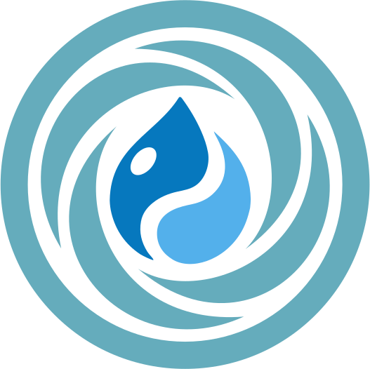
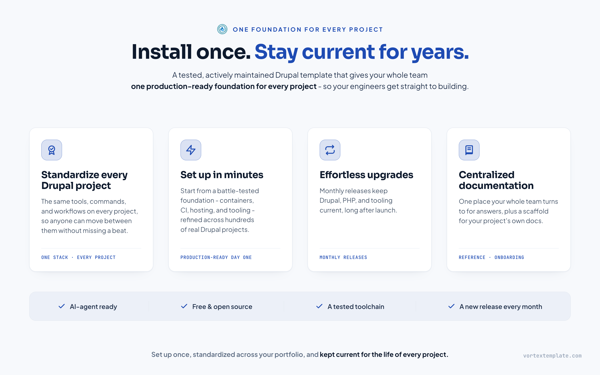

<div align="center">
  <picture>
    <source media="(prefers-color-scheme: dark)" srcset=".vortex/docs/static/img/logo-vortex-light.svg" />
    
  </picture>
</div>

<h1 align="center">Vortex</h1>
<h3 align="center">Drupal project template</h3>

<div align="center">

[](https://github.com/drevops/vortex/actions/workflows/build-test-deploy.yml)
[](https://circleci.com/gh/drevops/vortex)
[](https://github.com/drevops/vortex/actions/workflows/vortex-test-common.yml)
[](https://github.com/drevops/vortex/actions/workflows/vortex-test-docs.yml)
[](https://codecov.io/gh/drevops/vortex)


</div>

**Vortex** is a unified Drupal project template - one tested foundation your team installs once, picks features from, and pulls upstream updates into for as long as the project lives.

The outcome: every site in your portfolio looks, builds, tests, and deploys the same way. New hires onboard against a familiar stack. CI and hosting integrations come pre-wired. When **Vortex** releases each month, your project can adopt the upstream changes through the same installer that set it up.

<div align="center">
  <picture>
    <source media="(prefers-color-scheme: dark)" srcset=".vortex/docs/static/img/diagram-dark.png">
    
  </picture>
</div>

## Who Vortex is for

### For CTOs and engineering directors

You need every Drupal project in your portfolio to look, build, and ship the same way, whether the team that owns it changes or not. **Vortex** gives you a tested template, monthly upstream releases, identical CI and hosting integrations across sites, and a paid-support contact for when something has to be someone's problem.

### For Drupal practice leads and agency principals

Each new client engagement starts with weeks of setup before any billable feature work begins. **Vortex** turns that setup into a known cost: one installer, an opinionated baseline your delivery team already knows, and a feature set you choose at install time, so every engagement starts at the same quality floor.

### For tech leads and engineering managers

You want new hires productive on day one and CI that does not surprise you on day thirty. **Vortex** ships pre-wired Docker, GitHub Actions and CircleCI configurations, code quality tooling, a testing harness, and AI-agent project context, so every team in your organization learns the same stack.

### For senior Drupal developers

You want to write Drupal, not babysit infrastructure. **Vortex** gives you the same `ahoy` commands, the same containers, and the same testing scaffolds on every project, so the muscle memory you build on one site transfers to the next.

### For DevOps and platform engineers

You need local, continuous integration, and hosting to behave identically and dependency updates to land on a known cadence. **Vortex** ships one provisioning script that runs in every environment, first-class Acquia and Lagoon integrations, Renovate-driven dependency updates, and opt-in visual regression with a label gate.

## What is inside Vortex

**Vortex** is more than a code template. It ships three pieces that work together:

- 📦 **Template** - the pre-configured Drupal project: containerized local environment (Docker Compose + Ahoy), GitHub Actions and CircleCI pipelines, Acquia and Lagoon hosting integrations, code quality tooling (PHPCS, PHPStan, PHPMD, Rector, Twig CS Fixer, ESLint), and a testing harness (PHPUnit, Behat with screenshot capture).
- 📖 **Documentation** - centralized guidance at [vortextemplate.com](https://www.vortextemplate.com), a scaffold for your project-specific docs, and an onboarding checklist for new team members.
- 🎛️ **Installer** - a standalone CLI that adds only the features you select, renames boilerplate to your project, and upgrades existing installations to newer **Vortex** versions.

➡️ See the full [feature list](https://www.vortextemplate.com/docs/features) and the [architecture overview](https://www.vortextemplate.com/docs/architecture).

## Day 1, Month 6, Year 3

**Vortex** is built for the whole life of your project, not just the first commit.

- 🚀 **Day 1** - Run the installer, pick features, and you have a Drupal site building locally, running in CI, and ready to deploy to staging.
- 🔧 **Month 6** - Renovate keeps dependencies current. The provisioning script runs the same way for every developer. New hires onboard against pre-wired tooling instead of tribal knowledge.
- 🛟 **Year 3** - Monthly **Vortex** releases bring upstream tooling, PHP, and Drupal updates. The installer applies them to your project, so it stays current instead of drifting.

## Quick start

```bash
curl -SsL https://www.vortextemplate.com/install > installer.php && php installer.php
```


Alternatively, clone this repository and edit out the sections you do not need.

➡️ Read the [installation guide](https://www.vortextemplate.com/docs/installation) for the full walkthrough.

### Installing with an AI coding agent

The installer ships built-in support for AI coding agents. Run with `--agent-help` to get full instructions for programmatic installation:

```bash
curl -SsL https://www.vortextemplate.com/install > installer.php && php installer.php --agent-help
```

### Development version

The latest development build of the installer from the `develop` branch is at https://vortex-docs.netlify.app/install:

```bash
curl -SsL https://vortex-docs.netlify.app/install > installer.php && php installer.php
```

## See Vortex in production

The [DrevOps website](https://github.com/drevops/website) is a real production Drupal site built on **Vortex**. It receives regular upstream updates and shows what a long-lived **Vortex** project looks like in practice: CI configuration, testing workflows, and the update routine teams run between releases.

Use it as a reference for structuring your own **Vortex**-based site, or as a working example of how the template evolves over time.

## Documentation

The full **Vortex** documentation lives at [https://www.vortextemplate.com](https://www.vortextemplate.com). Good starting points:

- [Architecture](https://www.vortextemplate.com/docs/architecture) - how the pieces fit together
- [Features](https://www.vortextemplate.com/docs/features) - the full feature list
- [Installation](https://www.vortextemplate.com/docs/installation) - install into a new or existing project
- [Updating Vortex](https://www.vortextemplate.com/docs/updating-vortex) - pull in upstream releases
- [FAQs](https://www.vortextemplate.com/docs/faqs) - quick answers to common questions

Documentation is authored under [`.vortex/docs`](.vortex/docs) in this repository and published on each **Vortex** release. The latest development preview is at [https://vortex-docs.netlify.app/](https://vortex-docs.netlify.app/).

For a high-level overview, see the [DrupalSouth 2025 presentation](https://docs.google.com/presentation/d/e/2PACX-1vQMBTteMr6cALYGtI3xwqvt9HFpzSzTsV3ie5qhVMPK5eSZBudyQp7H1_Wfoy7HMYqfgN2ooH4rlWJL/pub?start=false&loop=false&delayms=5000) ([Google Slides](https://docs.google.com/presentation/d/1nsFfd9C_ddKD5O0sQeJ8_6pJjU0XWaXXwDmD0SwCIL4/) | [PDF](https://docs.google.com/presentation/d/1nsFfd9C_ddKD5O0sQeJ8_6pJjU0XWaXXwDmD0SwCIL4/export/pdf)).

## Releases and roadmap

**Vortex** ships a release every month. Subscribe to GitHub releases or follow the [updating guide](https://www.vortextemplate.com/docs/updating-vortex) to keep your project current.

- [Project development board](https://github.com/orgs/drevops/projects/2/views/1)
- [Project planning board](https://github.com/orgs/drevops/projects/2/views/3)

## Support

Paid support for **Vortex** covers:

- New and existing project onboarding
- Support plans with SLAs
- Priority feature implementation
- Updates to the latest version of **Vortex**
- Custom implementations and consulting

Email [support@drevops.com](mailto:support@drevops.com).

Community support is on the [`#vortex-project-template`](https://drupal.slack.com/archives/CRE86HQTW) channel in Drupal Slack and on [GitHub Issues](https://github.com/drevops/vortex/issues).

## Contributing

See the [contributing guide](https://www.vortextemplate.com/docs/contributing) for how to get involved.

## License

**Vortex** is licensed under [GPL-3.0](https://www.gnu.org/licenses/gpl-3.0.en.html). See [LICENSE](LICENSE) for details.
