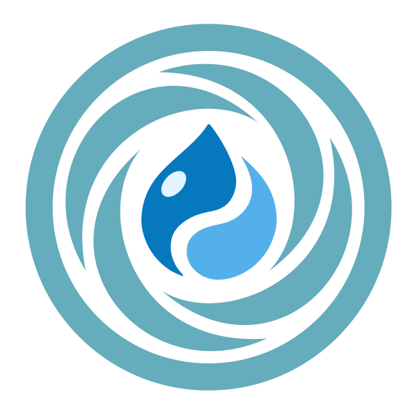

<div align="center">
  <picture>
    <source media="(prefers-color-scheme: dark)" srcset=".vortex/docs/static/img/logo-vortex-light.svg" />
    
  </picture>
</div>

<h1 align="center">Vortex</h1>
<h3 align="center">Drupal project template</h3>

<div align="center">

[](https://github.com/drevops/vortex/actions/workflows/build-test-deploy.yml)
[](https://circleci.com/gh/drevops/vortex)
[](https://github.com/drevops/vortex/actions/workflows/vortex-test-common.yml)
[](https://github.com/drevops/vortex/actions/workflows/vortex-test-docs.yml)
[](https://codecov.io/gh/drevops/vortex)


</div>

**Vortex** is a Drupal project template designed to streamline onboarding,
accelerate development, and support long-term maintainability.

It provides a complete foundation for building and deploying Drupal sites —
including containerized local environments, automated testing and code quality
tools, CI/CD pipeline configurations, and integrations with popular hosting
platforms. Everything is pre-configured and ready to use, so teams can focus on
building features instead of setting up infrastructure.

By standardizing project structure and tooling, Vortex ensures a consistent
developer experience across every project that uses it. Whether you’re starting
fresh or joining an existing Vortex-based site, you can get up to speed quickly
and start contributing right away.

The template is actively maintained and kept in sync with the latest tools.
Every change is verified through automated tests to ensure updates remain stable
and reliable — reducing the risk of regressions and making it easier to maintain
projects over time.

Track our current progress and view planned updates on [the GitHub project board](https://github.com/orgs/drevops/projects/2/views/1).

## Installation

Our installer simplifies setup, letting you choose only the features you need.
It will integrate the latest Vortex release into your codebase, and you will
choose which changes to commit.

```bash
curl -SsL https://vortex.drevops.com/install > install.php && php install.php
```

Alternatively, clone this repository and adjust the configuration by manually
editing or deleting the sections that aren't necessary for your setup.

Read
the [installation guide](https://vortex.drevops.com/getting-started/installation)
for more details.

## Features

<div align="center">
  <picture>
    <source media="(prefers-color-scheme: dark)" srcset=".vortex/docs/static/img/diagram-dark.png">
    
  </picture>
</div>

See [Features](https://vortex.drevops.com/getting-started/features) for more details.

## Documentation

The documentation is authored within this repository in the [`.vortex/docs`](.vortex/docs) directory and published to [https://vortex.drevops.com](https://vortex.drevops.com) on Vortex release.

Development version of the documentation is available at [https://vortex-docs.netlify.app/](https://vortex-docs.netlify.app/).

## Support

We provide paid support for **Vortex**:

- New and existing project onboarding
- Support plans with SLAs
- Priority feature implementation
- Updates to the latest version of the platform
- Vortex consulting and custom implementations

Contact us at support@drevops.com
