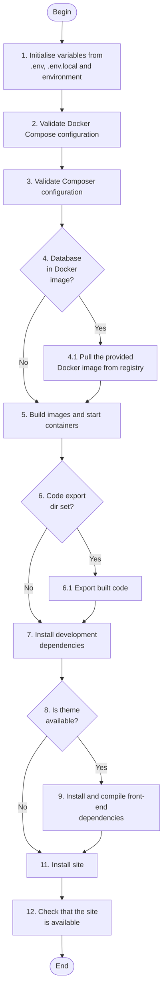

# Build

The full site build process is scripted in the [build](../../../../scripts/drevops/build.sh) script.
It is designed to be run locally and in CI with a single command to handle:

1. Docker Compose and Composer configuration validation
2. Building Docker images and starting containers
3. Calls site installation script
4. Checking that the stack works correctly and the site is availble

Practically, the script is a wrapper for commands that would be ran manually
and contains minimal workflow logic.

The build can be invoked by `ahoy build`.

The actual steps are described in the diagram below.

